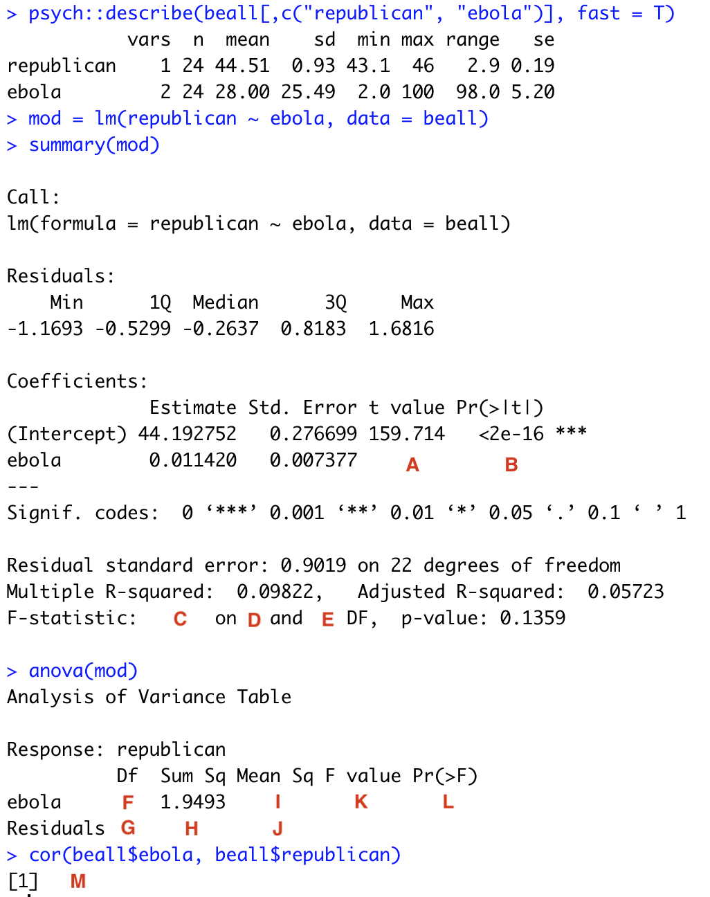

```{r setup, include=FALSE}
key = TRUE
knitr::opts_chunk$set(echo = key, eval = key)
library(tidyverse)
```
# Instructions

Please complete this assignment using the [RMarkdown file](homework-1.Rmd) provided. Once you download the RMarkdown file please (1) include your name in the preamble, (2) rename the file to include your last name (e.g., "weston-homework-1.Rmd"). When you turn in the assignment, include both the .Rmd and knitted .html files.  

To receive full credit on this homework assignment, you must earn **30 points**. You may notice that the total number of points available to earn on this assignment is 65 -- this means you do not have to answer all of the questions. You may choose which questions to answer. You cannot earn more than 30 points, but it may be worth attempting many questions. Here are a couple things to keep in mind:

1. Points are all-or-nothing, meaning you cannot receive partial credit if you correctly answer only some of the bullet points for a question. All must be answered correctly.

2. After the homework has been graded, you may retry questions to earn full credit, but you may only retry the questions you attempted on the first round. 

3. The first time you complete this assignment, it must be turned in by 9am on the due date (February 7). Late assignments will receive 50% of the points earned. For example, if you correctly answer questions totaling 28 points, the assignment will receive 14 points. If you resubmit this assignment with corrected answers (a total of 30 points), the assignment will receive 15 points.

4. You may discuss homework assignments with your classmates; however, it is important that you complete each assignment on your own and do not simply copy someone else’s code. If we believe one student has copied another’s work, both students will receive a 0 on the homework assignment and will not be allowed to resubmit the assignment for points.

**Data:** Some of the questions in this homework assignment use the dataset referred to as `homework-anxiety`. [Link to data goes here.] In this dataset, you'll find four variables: id - numeric, refers to participant ID; Anxiety - participant's average levels of anxiety over a week; Stress -- the participant's average level of stress over a week; Support -- the participant's perceived social support over a week; and group -- categorical, whether the participant was randomly assigned to a treatment group in which they given mediation instructions and were required to meditate for 10 minutes each day during the week. 

Some questions refer to the dataset `homework-dawtry.csv` This dataset comes from Study 1a in the article by [Dawtry et al. (2015)](Dawtry et al 2015 PS.pdf), which examines the relationship between wealth and perception of wealth. Study 1a is an observational study in which American participants indicated their own household income and estimated how incomes are distributed across both their immediate social circles and the wider population. Participants then indicated how fair and satisfactory they perceived society to be and whether they supported redistribution efforts, as well as their political orientation. You may need to refer to the article to complete the questions associated with this dataset. 

# 2-point questions

### Question 1

* Given a sample size of 40 participants, what is the smallest correlation we are able to detect as being significantly different from 0? Use a two-tailed test and $alpha = .05$. 

* Given a sample size of 40 participants, what is the smallest correlation we are able to detect as being significantly different from .3? Use a two-tailed test and $alpha = .05$. 

### Question 2

You are contacted by the Dean's office. They ran a correlation between UO undergraduate SAT scores and happiness and found a correlation of r = .21061 with a sample of $N = 600$. They want to know if this is lower than a published meta-analytic estimate (.2554)? 

* Is the correlation found in the UO sample significantly different from the population parameter? Do this "by hand". Treat the meta-analytic estimate as the "population."

* Calculate a 95% confidence interval around the estimate correlation "by hand." 

* What would the 95% confidence interval around this estimate be if the sample size were only $N = 60$?

### Question 3{#q2.3}

| X | Y  |
|---|----|
| 1 | 1  |
| 5 | 18 |
| 5 | 13 |
| 5 | 17 |
| 3 | 14 |
| 5 | 20 |
| 3 | 3  |
| 4 | 13 |
| 1 | 1  |
| 4 | 13 |
| 4 | 7  |
| 1 | 7  |
| 3 | 17 |
| 4 | 8  |
| 4 | 3  |

* Calculate the unstandardized regression equation (use Y as the outcome). You may use whatever functions you want.

* Calculate the standardized regression equation. You may use whatever functions you want.

### Question 4

You are given data with two variables, X and Y. The mean of X is 3 with a SD .75. Y has a mean of 4 with a SD of .50. The correlation between the two is r = .3. 

* "By hand", calculate the regression equation. Interpret each term in equation.

* "By hand," convert the equation into a standardized regression equation. Interpret each term.

### Question 5

* Use the `homework-anxiety` data. Using the three numeric variables, generate the partial correlation matrix and the semi-partial correlation matrix using the functions `pcor` and `spcor` in the `ppcor` package. 

* Compare the partial correlation matrix to the semi-partial correlation matrix. Note that one of these matrices is not symmetric.  Which matrix is not symmetric?

* Recall that semi-partial correlations estimate the correlation between variables A and B, partialing out a third variable (C) from one of those variables. Figure out which variable is partialled from which other variable in the semi-partial correlation matrix.

# 5-point questions

### Question 1

Refer to the data provided in [Question 2.3](#q2.3).

* Use the average product of z-scores method to calculate the correlation between x and y. How does this compare to the result of the cor() function? 

* Why do you think these differ? (Hint: is there a component of the z-score calculation that be computed with two different formulas?)

* Change your code in such a way that the product of z-scores does in fact equal the correlation between x and y. 

### Question 2

* Use the `homework-anxiety` data. Run a regression with Social Support (X) predicting Anxiety (Y). Then run a regression with Anxiety predicting Social Support. What is similar and different between these analyses?

* Graph the regression with Anxiety as the DV. Include a confidence band and raw data points. Be sure your figure includes a title and caption.

* For the regression of Social Support predicting Anxiety, correlate the fitted values with: a. residuals, b. Social Support, c., Anxiety. Explain the patterns you find.

* Using the anova function for the model output, calculate R squared "by hand" using numbers in the anova table.

* For the same model, interpret the residual standard error.

### Question 3 

Choices that individuals make in the voting booth, such as whether to support a more conservative or
liberal candidate, may be affected by a number of factors. In their research, Beall, Hofer,
and Schaller (2016) sought to examine the role of outbreaks of infectious diseases on voting behavior. The authors hypothesized that an outbreak of a disease, such as Ebola, may increase support for more conservative political candidates. To test this hypothesis, the authors examined the frequency of Google searches for “Ebola” during the weeks prior to and after the outbreak of Ebola that occurred in 2014. The authors also examined support for the conservative Republican party in the US.

Below is an image of the output from a regression analysis, using their data: `republican` is a measure of support for the republican party; `ebola` is an index of the number of searches for Ebola on Google. Each observation was a day leading up to the national election. (Note, if this image does not load, you may need to download it from GitHub and save it in the same location as your homework file.)

There are some missing values in the output, labeled with red letters. Complete the output by computing the missing values (A-L).



# 10-point questions

### Question 1

* Using the data from [Dawtry et al. (2015)](Dawtry et al 2015 PS.pdf)), replicate the correlation matrix part of Table 1. (Note: you will have to create at least one composite to do so, and some of the items may need to be reverse scored.)

* Calculate the means and standard deviations for Table 1 variables.

* Graph the distributions of Household Income, Fairness and Satisfaction, Social circle mean income, population mean income, and political preference. Comment on anything you find irregular or interesting.

* Run a regression where political preferences predict redistribution. Interpret the intercept, the regression coefficient and $R^2$. Then create a scatter plot with a best fit line between redistribution and political preference variables. Be sure your figure includes a title and a caption.

* Dichotomize the political preferences data into a dichotomous conservative and liberal variable, assuming the midpoint is conservative. Then run a linear model with this new binary variable predicting redistribution. What are the conceptual differences between the regression in #5 and #6. Which one would you prefer?

### Question 2

*t*-tests are a simple form of regression, where there is only one predictor variable and it is binary. In the process of estimating this model, R takes the the character variable associated with X and creates a new variable of 0's and 1's. 0's correspond to a reference group and 1's correspond to the other group. 

* Using the `homework-anxiety`, estimate the regression model with Support as the outcome and group as the predictor. Which level of group was made the reference group? How can you tell?

* Create your own variable inside the `homework-anxiety` data frame of 1's and 0's that make the other level the reference group. Estimate the regression model with this new variable. How are the two models the same and how are they different?

* Now create a new variable with 0 (reference group) and 5 (other group). (You can choose which level is the reference group.) Run the regression model with this variable. What do the intercept and slope represent?

* Now create a new variable where the reference group is represented by -1 and the other group is represented by 1. Run the regression model with this variable. What do the intercept and slope represent? (Hint: it may help to run descriptive statistics on your data frame to figure this out).

# 20-point questions

### Question 1

In PSY 611 we discussed the problem of p-hacking, which can arise in quite a number of ways. While we have not spent much time talking about p-hacking this term, regression models are just as susceptible to p-hacking. In fact, there are be additional tools researchers can exploit to generate significant p-values. 

Imagine that you have access to a large dataset $(N = 50)$, one that has an outcome you're interested in studying (Y) and a variable that you believe causes that outcome (X). You create a model regressing Y on X and test the significance of the slope coefficient of X. If this is significant, then great! You stop analyzing the data. But if this is not significant, you try adding different covariates to your model, one at a time, until the slope of X is significant or you run out of covariates, whichever comes first. 

Simulate this scenario 10,000 times. Set a seed (using `set.seed` at the beginning so I can reproduce your results). For each simulated study, each variable should be randomly drawn from a normal distribution. In other words, the data will be consistent with the null hypothesis. For each study, tally whether the null hypothesis is rejected, the number of regression models that are built, the final unstandardized regression coefficient associated with X, and the final p-value associated with the slope of X. The proportion of rejections over the 10,000 studies is the empirical Type I error rate. We are interested in whether this matches closely the significance level chosen for the t-test (i.e., .05). The average effect size across the 10,000 studies should be close to 0. We're also interested in the distribution of p-values across this simulation. 

One strategy would be to use an outer loop to index the 10,000 scenarios and an inner loop to index the changing of the regression model within a study. Some conditionals will be needed to decide if an interim slope test is significant. You will also need a way to stop a given scenarios and move on to the next one if the test of the slope is significant. 

* First, determine the empirical Type I error rate for the scenario described above. How does it compare to the significance level of .05 set for the inferential test of the slope?

* Determine the average effect size for this repeated testing scenario. How does it compare to the expected value given that the null hypothesis is true in this simulation?

* Construct a histogram that shows the distribution of final p-values for the 10,000 studies. Comment on anything you notice as being odd about the shape of this distribution.

* Construct a histogram that shows the distribution of final p-values for the 10,000 studies, but limit this figure to only p-value smaller than .10. Can you make any conclusion about the likelihood of specific p-values when the null hypothesis is true and the researcher is p-hacking?

* Repeat the scenario above, but without the addition of any covariates. Construct a histogram that shows the distribution of final p-values for the 10,000 studies. What do you conclude about the distribution of p-values when the null hypothesis is true and the researcher is not p-hacking?
