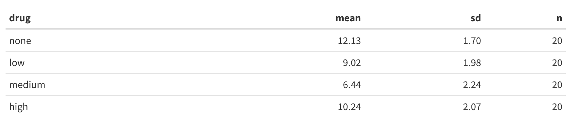
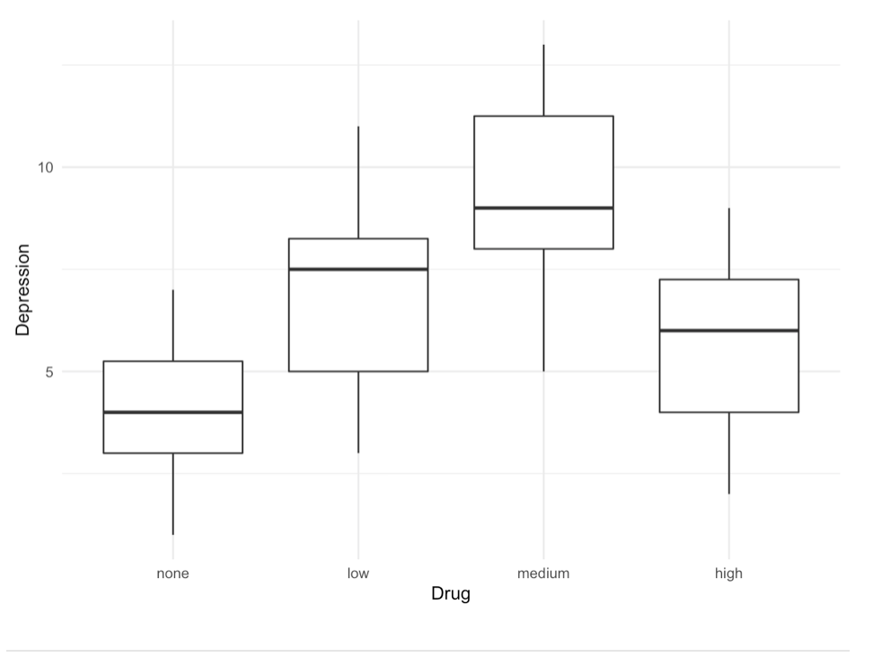

```{r setup, include=FALSE}
knitr::opts_chunk$set(rows.print = 15)

# suppress scientific notation
options(scipen = 999)
```


# Purpose

Today's lab will focus on one-way ANOVA. We will start with the traditional way like Sarah did in class on Thursday. However, the majority of the lab time afterwards will focus on running an ANOVA as a linear regression with a categorical predictor. Though we haven't talked about it yet, the content will be covered in next week's class.

Be sure to have the following packages loaded:

```{r, message=FALSE, warning = FALSE}
library(tidyverse) # for plotting and data wrangling
library(rio) # for importing data
library(psych) # for descriptives
```

# Research scenario

We'll be looking at a dataset comparing different kinds of treatment for depression. In this study, depressed patients (n = 5 per group) were randomly assigned to one of three groups:

1.	CBT group 
2.	Psychotherapy group 
3.	Control group (received no therapy) 

After 10 weeks, participants' depression scores were measured (on a scale of 1 = no depression to 12 = severely depressed). Our dataset will have just 2 variables: `group` (CBT, Psychotherapy, or Control) and `depress` (depression scores). 

**NOTE:**
`1` = CBT; 
`2` = Psychotherapy;
`3` = Control

Import the data

```{r}
depression <- import("https://raw.githubusercontent.com/uopsych/psy612/master/labs/lab-5/data/depression_therapy.csv")
```

## Structure of the data

The first thing we should check is how the data are structured. We should have a factor called `group` and a numeric variable for depression scores called `depress`. Let's use the function `str()`.


```{r}
str(depression)
```

## Recode `group` as a factor

R thinks that `group` is an integer, so we need to make it into a factor in order to run our analysis. We can use `mutate()` and base R's `factor()`, which can be used to turn variables into factors.

NOTE: You want to provide labels in the same order as the levels of the factor, so in this case we want them in the order `CBT`, `Psychotherapy`, and `Control` (see above). 

```{r}
depression <- depression %>% 
  mutate(group = factor(group,
                            labels = c("CBT", "Psychotherapy", "Control"))) # order matters here! 
```

Look at the structure of the data again. Now it's clear that `group` is a factor variable with the correct levels. 

```{r}
str(depression)
```


## Descriptives

Next, we'll get descriptives for each group using two tidyverse functions, `group_by()` and `summarize()`. First, you want to group by `group`, and then you want to summarize with three arguments, mean, sd, and n.

Click [here](https://uopsych.github.io/psy611/labs/lab-5.html#Summarizing_data) to see how we did it in psy611.

```{r}
depression %>% 
  group_by(group) %>% 
  summarize(mean = mean(depress, na.rm = TRUE),
            sd = sd(depress, na.rm = TRUE),
            n = n()) %>% 
  knitr::kable(digits = 2)
```


You can also get descriptives with the describeBy() function. Try adding `mat = TRUE` as an argument.

```{r}
describeBy(depression$depress, depression$group, mat = TRUE)
```

## Visualizing the data

There are many ways that you can visualize the data. In ggplot, I recommend adding a `geom_boxplot()`, or `geom_bar()`, or `geom_violin()` layer.

[This](https://www.r-graph-gallery.com/boxplot.html) is a good resource for boxplots with ggplot, [this](https://www.r-graph-gallery.com/barplot.html) is a good resource for bar plots with ggplot, and [this](https://www.r-graph-gallery.com/violin.html) is a good resource for violin plots with ggplot.

```{r}
depression %>% 
  ggplot(aes(x = fct_reorder(group, depress), y = depress)) +
  geom_boxplot() +
  geom_jitter() +
  theme_minimal() +
  labs(x = NULL,
       y = "Average depression score",
       fill = "Group",
       title = "Depression scores per group")

depression %>% 
  group_by(group) %>% 
  summarise(avg_depress = mean(depress),
            sd = sd(depress)) %>% 
  ggplot(aes(x = fct_reorder(group, avg_depress), 
             y = avg_depress)) +
  geom_bar(stat = "identity",
           fill = "cornflowerblue") +
  theme_minimal()+
  labs(y = "Average depression score",
       x = NULL,
       title = "Average depression score per group") +
  geom_errorbar(aes(ymin=avg_depress - sd, ymax=avg_depress + sd),
                width = .1)

depression %>% 
  ggplot(aes(x = fct_reorder(group, depress), y = depress)) +
  geom_violin(aes(fill = group)) +
  geom_jitter() +
  theme_minimal() +
  labs(x = NULL,
       y = "Average depression score",
       fill = "Group",
       title = "Depression scores per group")+
  theme(legend.position = "none") 

```

***

# Traditional ANOVA

We have just reviewed in detail how to do an ANOVA within a linear regression framework. We will briefly review how to generate a traditional ANOVA table, though this will give us the same information we already got from our regression model. 

To get an ANOVA table, you can use`stats::aov()` and provide it with the same information you would pass to `lm()`, namely a formula (e.g. `IV ~ DV`) and the `data`. Again, make sure that the categorical IV is a factor. 


```{r}
model_anova <- aov(depress ~ group, data = depression)
summary(model_anova)
```

To calculate pairwise comparisons between group levels, use `pairwise.t.test()`. This function takes arguments `x` (the outcome variable), `g` (the grouping variable) an `p.adjust.method` (e.g. "bonferroni" or "holm").


```{r}
pairwise.t.test(x = depression$depress, g = depression$group, p.adjust.method = "none")
```

Since we are running a lot of test, we need to correct for multiple comparisons so that we don't have an inflated type I error rate.


* Bonferroni correction:multiplies the p-values by the number of comparisons.

```{r}
pairwise.t.test(x = depression$depress, g = depression$group, p.adjust.method = "bonferroni")
```

* Holm correction: 
  * Rank order the p-values from largest to smallest.
  * Start with the smallest p-value. Multiply it by its rank.
  (0.000052 *3 = 0.000156)
  * Go to the next smallest p-value. Multiply it by its rank. If the result is larger than the previous step, keep it. Otherwise replace with the previous step adjusted p-value.
  (0.0034 * 2 = 0.0068)
  * Repeat Step 3 for the remaining p-values.
  (0.0286 * 1 = 0.0286)
  * Judge significance of each new p-value against α=.05


```{r}
pairwise.t.test(x = depression$depress, g = depression$group, p.adjust.method = "holm")
```

>**Question:** What difference do you notice about the Bonferroni vs. Holm correction? 

***

# Regression with categorical predictors


## Dummy coding

In regression, categorical predictors with more than two levels are broken up into more than one predictor. This actually happens under the hood in R when our independent variable is a factor. Let's see what happens when we put `group` as the predictor in our model:


```{r}
model_default <- lm(depress ~ group, data = depression) 
summary(model_default)
```

Here is our regression equation:

$$Depression_i = \beta_0 + \beta_1psychotherapy_i + 
\beta_2control_i + e_i$$

R is creating two dummy variables for us under the hood: `groupPsychotherapy` and `groupControl`.  This is what R is doing:

```{r}
depression %>%
  mutate(groupPsychotherapy = ifelse(group == "Psychotherapy", 1, 0),
         groupControl = ifelse(group == "Control", 1, 0)) 
```


By default, R treats whatever the first level of the factor variable is as the reference group. In this case, CBT was the first level of `group` (because it was initially coded as `1` in our raw data), so the model treated CBT as our reference group.

Here is our regression equation, derived from the output:

$$Depression_i = 7.20 -3.80psychotherapy + 2.60control$$

>**Question:** Determine the mean depression score of each group.


Now, let's revisit the output.
```{r}
model_default <- lm(depress ~ group, data = depression) 
summary(model_default)
```
>**Question:** Interpret the intercept. What does a significant p-value signify?

>**Question:** Interpret the slopes. What do the significant p-values signify?


Let's imagine that we have the following (more intuitive) research questions:

1. Is CBT effective (relative to no therapy)? 
2. Is psychotherapy effective (relative to no therapy)?  

>**Question:** What do want our reference group to be to answer these research questions?

Now let's make the appropriate dummy codes. Recall that we need *k*-1 dummy codes (where *k* is the number of groups). We have 3 groups, so we need 2 dummy codes. 

Remember, our decision of how to set the dummy codes (which group to set as the **reference group**) should be guided by our research questions. 


### Method 1: Create dummy variables with `mutate()`

```{r}
# create new dummy variables containing 1's and 0's
depression <- depression %>%
  mutate(CBT.v.Control = 
           ifelse(group == "CBT", 1, 0), 
         Psychotherapy.v.Control = 
           ifelse(group == "Psychotherapy", 1, 0)) 

depression
```

Now, we can run the linear model using these new dummy variables as the IV's.


```{r}
model_dummy1 <- lm(depress ~ CBT.v.Control + Psychotherapy.v.Control, data = depression) 
summary(model_dummy1)
```

>**Question:** What does the intercept mean? What do the slopes mean?

>**Question:** What does the F test tell us?
 

### Method 2: Contrast Matrix

Now we're going use another method to create our dummy codes by creating a contrast matrix. When we pass a factor to `lm()` it uses a contrast matrix under the hood. Although R creates the contrast matrix automatically with certain default assumptions, you can set it yourself if you have a specific set of codes in mind (which we do).

Use `contrasts()` to view the default contrast matrix associated with our grouping variable.

```{r}
contrasts(depression$group)  
```

Again, by default our contrasts are not how we want them because we want `Control` to be the reference group. To manually specify our dummy codes, we'll use the function `contr.treatment()`, which will return a contrast matrix with specific characteristics, depending on what we tell it. The first argument, `n` is the number of levels of the factor variable. The second argument, `base` refers to the level of the factor that should be considered the reference group.

```{r}
contr.treatment(n = 3, base = 3)    
```

We can now overwrite the default contrast matrix for `group` with the one we just manually specified.

```{r lab-5-27}
contrasts(depression$group) <- contr.treatment(n = 3, base = 3)    
```


* Now look at the structure of the data again. What do you notice about `group`?


```{r}
str(depression)
```

Let's take a closer look at `group` using `attributes()`...

```{r}
attributes(depression$group)
```


Now, run the linear model with `group` (now containing our desired dummy codes) as the IV.

```{r}
model_dummy2 <- lm(depress ~ group, data = depression) 
summary(model_dummy2)
```

### Method 3: Re-order levels of your factor

Let's take another look at the levels of `group`

```{r}
levels(depression$group)
```

We can manually change the order of the levels by using `factor()` and manually specifying the `levels` argument to contain the order we want. Again, since R treats the first level of the factor as the reference group, and we want `Control` to be the reference group in order to obtain our contrasts of interests when we run the linear model, we will create a new version of `group` called `group_relevel` and make `Control` the first level of the factor in this new variable.

```{r}
depression <- depression %>% 
  mutate(group_relevel = factor(group, levels = c("Control",
                                                  "CBT",
                                                  "Psychotherapy"))) 
```

To double check that this worked, let's look at the levels of `group_relevel`


```{r}
levels(depression$group_relevel)
```

Now when we run the linear model, the contrast matrix that will be automatically generated will correspond to the correct contrasts we want. To verify this, let's re-run the linear model (yet again!) with the re-leveled `group_relevel` variable as the IV. 

```{r}
model_dummy3 <- lm(depress ~ group_relevel, data = depression) 
summary(model_dummy3)
```

## Deviation coding

Instead of dummy coding, we can other types of coding, like **deviation coding** (also called "effects coding") to compare individual group means to the overall mean of the dependent variable (i.e. the grand mean). In R, we do this in basically the same way as dummy coding, but just change the values we use to set the codes. 

**NOTE: This will change how we interpret our coefficients!**. When using effects coding, the intercept represents the grand mean. The coefficients of each of the effect-coded variables is equal to the difference between the mean of the group coded 1 and the grand mean. 

With effects coding, the reference group will end up being coded with all `-1`'s.
 
Let's imagine our research questions are as follows: Is CBT effective compared to the overall sample? Is Psychotherapy effective compared to the overall sample?

We'll create our contrast matrix of effects codes in a very similar way to how we made our dummy codes. The only difference is that this time we will use `contr.sum()`, again telling it the number of levels of our grouping factor (`n = 3`)


```{r}
contr.sum(n = 3)
```

And as before with dummy codes, we overwrite the default contrast matrix with our effect codes.

```{r}
contrasts(depression$group) <- contr.sum(n = 3)
```

Run the linear model with effects coding

```{r}
model_ec <- lm(depress ~ group, data = depression) 
summary(model_ec)
```


>**Question:** What does the intercept mean? The slopes? 

There are many other coding schemes besides dummy and deviation coding. You can read more about that [here](https://stats.idre.ucla.edu/r/library/r-library-contrast-coding-systems-for-categorical-variables/){target="_blank"}. 

***

# Minihacks{#minihacks}

Research Problem: 

You are interested in the effectiveness of a new drug in treating the symptoms of depression. You randomly assign patients with depression into one of 3 treatment groups with different levels of the drug (low, medium, and high), and also one control group that only received a placebo. You then measure their symptoms after 4 weeks of drug treatment. You are interested in whether the drug is effective, and what level of the drug is most effective.

* Load in the raw data with the following code

```{r lab-5-57}
depression_drug <- import("https://raw.githubusercontent.com/uopsych/psy612/master/labs/lab-5/data/depression_drug.csv")
```

## Minihack 1

Recreate the following table.


```{r}
depression_drug <- depression_drug %>% 
  mutate(drug = factor(drug, 
                       levels = c("none", "low", "medium", "high")))

depression_drug %>% 
  group_by(drug) %>%
  summarize(mean = mean(depression, na.rm = TRUE),
            sd = sd(depression, na.rm = TRUE),
            n = n()) %>% 
  knitr::kable(digits = 2) 
```


<br> 

Recreate the following boxplot.



What pattern do you notice in the data? 

```{r}
depression_drug %>% 
  ggplot(aes(drug, depression)) + 
  geom_boxplot() + 
  theme_minimal() + 
  labs(x = "Drug", y = "Depression")
```

***

## Minihack 2

* Run an omnibus ANOVA test to determine whether there is a relationship between `drug` and `depression`. What does this tell you? 

```{r}
anova_drug <- aov(depression ~ drug, data = depression_drug)
summary(anova_drug)
```

At least one group was different than another group in depression level.

* Using your preferred method of dummy coding, test whether there is a significant difference between depression scores for each drug group (`low`, `medium`, `high`) and the `none` group. Interpret all model coefficients.

```{r}
depression_drug <- depression_drug %>% 
  mutate(drug = factor(drug, levels = c("none", "low", "medium", "high")))

contrasts(depression_drug$drug) <- contr.treatment(n = 4, base = 1)  

model_drug <- lm(depression ~ drug, data  = depression_drug)
summary(model_drug)
```

***

## Minihack 3

* Conduct pairwise comparisons for `depression` scores across all levels of `drug`. Use a correction method to account for multiple comparisons. 

```{r}
pairwise.t.test(x = depression_drug$depression, g = depression_drug$drug, p.adjust.method = "none")

pairwise.t.test(x = depression_drug$depression, g = depression_drug$drug, p.adjust.method = "bonferroni")
```

