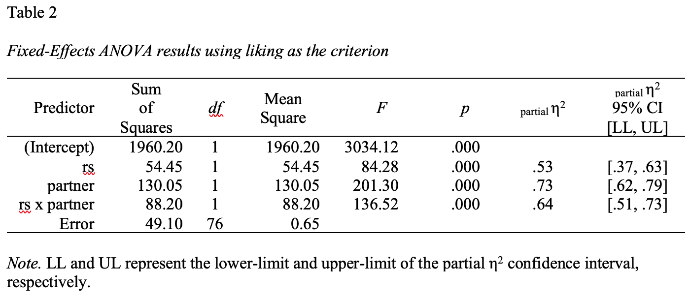

```{r setup, include=FALSE}
# suppress scientific notation
options(scipen = 999)
```


# Purpose
Factorial ANOVA refers to a special case of the general linear model in which there is an interaction of two or more categorical variables (i.e. *factors*). A factorial design is used when there is an interest in how two or more variables (or factors) affect some outcomes variable. Rather than conduct separate one-way ANOVAs for each factor, they are all included in one analysis. Today we will review how to run factorial ANOVA models in R and how to interpret and visualize the results. 


1. [Research scenario](#scenario)
2. [Tables of means](#means)
3. [Run the model](#model)

Be sure to have the following packages installed and loaded:

```{r message=FALSE}
library(tidyverse) # for plotting and data wrangling
library(rio) # for importing data
library(psych) # for descriptives
library(lsr) # for eta squared functions
library(emmeans) # for marginal means and simple effects
library(sjPlot) # for plotting model results 
library(ggpubr) # for arranging plots
library(apaTables) # for tables of means
library(car) # for testing model assumptions
library(broom) # for tidying model output
```

***

# Research scenario{#scenario}

* Based on subjects' self-reports of rejection sensitivity (N = 80), a researcher divides subjects into two equal groups (low RS and high RS).  Whereas half of the subjects in each group interact with a partner who displays a happy emotional expression during the interaction, the other half of the subjects in each group interact with a partner who displays a neutral emotional expression during the interaction.  After the interaction, subjects are asked to rate the statement, "My interaction partner likes me", on a scale from 1 (strongly disagree) to 7 (strongly agree).

>**Question:** What type of factorial ANOVA design is this?  

>**Answer:** This represents a 2 x 2 factorial ANOVA.

<br>

## Data

```{r}
reject <- import("https://raw.githubusercontent.com/uopsych/psy612/master/labs/lab-8/data/reject.csv")
```

<br>

* Check out the data

```{r}
str(reject)
```

<br> 

```{r}
head(reject)
```

* It looks like `rs` and `partner` are both being read in as character variables. Let's go ahead and change those to factors.

```{r}
reject <- reject %>% 
  mutate(rs = as.factor(rs),
         partner = as.factor(partner))
```

* Check the structure again. Notice that by default R orders factor levels alphabetically. In our case, this means that `High` will be the reference group of rejection sensitivity and `Happy` will be the reference group of interaction partner's emotional expression. However, it might be more intuitive to have `Low` and `Neutral` be the reference groups, respectively. 

```{r}
str(reject)
```

* To accomplish this, we can simply re-order the levels of our factor varaibles with `fct_relevel()`.

```{r}
# manually specify order of factor levels
reject <- reject %>% 
  mutate(rs = fct_relevel(rs, c("Low", "High")), 
         partner = fct_relevel(partner, c("Neutral", "Happy")))
```

* To make sure this work, check the structure again.

```{r}
str(reject)
```

* Do we have a balanced design?

```{r}
reject %>%
  group_by(rs, partner) %>% 
  summarize(n = n())
```

***

# Tables of means{#means}

## Using `summarize()`

* We'll create 4 tables of means:

1. cell means (i.e., for each combination of the two factors)
2. marginal means for interaction partner (averaged across levels of rejection sensitivty)
3. marginal means for RS (averaged across levels of interaction partner)
- grand mean (averaged across both rejection sensitivity and interaction partner)

### Cell Means

```{r}
reject %>%
  group_by(rs, partner) %>% 
  summarize(mean = mean(liking, na.rm = TRUE),
            sd = sd(liking, na.rm = TRUE)) %>% 
knitr::kable(digits = c(NA, NA, 0, 2, 2),
             caption = "Cell Means & SD")
```

### Marginal Means: Interaction Partner

```{r}
reject %>%
  group_by(partner) %>% # instead of grouping by both factors, we just group by interaction partner
  summarize(mean = mean(liking, na.rm = TRUE),
            sd = sd(liking, na.rm = TRUE)) %>% 
knitr::kable(digits = c(NA, 0, 2, 2),
             caption = "Marginal Means & SD for Interaction Partner")
```

### Marginal Means: Rejection Sensitivity

```{r}
reject %>%
  group_by(rs) %>% # just group by rs for this one
  summarize(mean = mean(liking, na.rm = TRUE),
            sd = sd(liking, na.rm = TRUE)) %>% 
knitr::kable(digits = c(NA, 0, 2, 2),
             caption = "Marginal Means & SD for Rejection Sensitivity")
```

### Grand Mean

```{r}
reject %>% # note that we don't need group_by for this one
  summarize(mean = mean(liking, na.rm = TRUE),
            sd = sd(liking, na.rm = TRUE)) %>% 
knitr::kable(digits = c(0, 2, 2),
             caption = "Grand Mean")
```

## An easier way

* The `apa.2way.table()` function from `{apaTables}` is a much more convenienet way to get our cell means and marginal means. This function works for any type of 2-way ANOVA, regardless of the number of levels of your factors, e.g. it would work for a 3 x 3 ANOVA. All you need to do is indicate what the IV's and DV are and specify `show.marginal.means = TRUE`. 

```{r}
apa.2way.table(iv1 = rs, 
               iv2 = partner, 
               dv = liking, 
               data = reject,
               show.marginal.means = TRUE)
```


* An added plus is that you can easily export these tables to word (see `?apa.2way.table`).

#### {.tabset .tabset-fade .tabset-pills}

##### Code

```{r eval=FALSE}
apa.2way.table(iv1 = rs,
               iv2 = partner,
               dv = liking,
               data = reject,
               show.marginal.means = TRUE,
               table.number = 1,
               filename = here::here("/labs/lab-8/images/means.doc")) # example file path
```

##### Output

<center>

</center>

####
<br>

* Remember, a **main effect** is the effect of one IV on the DV completely ignoring the other variable(s).

<br>

>**Question:** Which means are being compared in the main effect of rejection sensitivity?

>**Answer:** marginal means for low (5.78) and high (4.13) levels of rejection sensitivity

>**Question:** Which means are being compared in the main effect of interaction partner?

>**Answer:** Marginal means for neutral partner (3.68) and happy partner (6.22) 

>**Question:**  Which means are involved in the interaction?

>**Answer:** the cell means

*** 

# Running the model{#model}

* Factorial ANOVA is the method by which we can examine whether two (or more) categorical IVs have joint effects on a continuous outcome of interest. Like all general linear models, factorial ANOVA is a specific case of multiple regression. However, we may choose to use an ANOVA framework for the sake of interpretability.

<br>

## Specify the model

* We can specify the factorial ANOVA model using `lm()` the same way we specified 

```{r}
model <- lm(liking ~ rs * partner, data = reject) 
```

* We can look at the regression coefficients from the model. However, in the case of factorial ANOVA, these are less useful to interpret. 

```{r}
summary(model)
```

## ANOVA table

* Instead, we will focus on the ANOVA table output. We can get this using `anova()`.

```{r}
anova(model)
```

>**Question:** Is there a main effect of rejection sensitivity on perceived liking? 

>**Answer:** Yes, BUT it depends on the interaction partner

>**Question:** Is there a main effect of interaction partner on perceived liking? 

>**Answer:** Yes, BUT it depends on the perceiver's rejection sensitivity 

>**Question:** Is there an interaction between rejection sensitivity and interaction partner? 

>**Answer:** Yes

* We can tidy the ANOVA table output with `broom::tidy()`

```{r}
anova(model) %>% 
  broom::tidy()
```

* `apaTables::apa.aov.table()` will generate an APA-formatted comprehensive ANOVA table for you

```{r}
# might need to have the {MBESS} package installed to use this function
# install.packages("MBESS")

apa.aov.table(lm_output = model,
              conf.level = .95)
```

* This also allows you to ouput tables to Word. 

#### {.tabset .tabset-fade .tabset-pills}

##### Code

```{r eval=FALSE}
apa.aov.table(lm_output = model,
              conf.level = .95,
              table.number = 2,
              filename = here::here("/labs/lab-8/images/anova_table.doc"))
```

##### Output

<center>

</center>

####
<br>

## Checking assumptions

* You can check the assumptions of the factorial ANOVA in much the same way you check them for multiple regression; but given the categorical nature of the predictors, some assumptions are easier to check.

* Homogeneity of variance, for example, can be tested using Levene's test, instead of examining a plot.

```{r}
car::leveneTest(liking ~ rs * partner, data = reject)
```

>**Question:** Have we met the homogeneity of variance assumption?

>**Answer:** Yes

## Effect size

* All of the effects in the ANOVA are statistically significant, but how big are they? An effect size $\eta^2$, provides a simple way of indexing effect magnitude for ANOVA designs. You can think of it the same way as $R^2$ (proportion of variance explained).

* To calculate $\eta^2$, we'll use  `etaSquared` from `{lsr}` (the companion package to your textbook). 

```{r}
lsr::etaSquared(model)
```

>**Question:** What does partial eta squared represent? Why might be prefer partial eta squared over eta squared? 

>**Answer:** One argument against eta squared is that its magnitude depends in part on the magnitude of the other effects in the design. Partial eta squared pretends the other effects do not exist, comparing only to residual variability. 

***

# Plotting

* Plot the main effects 

```{r}
rs_plot <- plot_model(model, type = "pred", terms = c("rs")) 
partner_plot <- plot_model(model, type = "pred", terms = c("partner")) 

ggpubr::ggarrange(rs_plot, partner_plot, ncol = 2)
```

* Plot the interaction

```{r}
plot_model(model, type = "int")
```

* Switch how the interaction is visualized

```{r}
plot_model(model, type = "pred", terms = c("partner", "rs"))
```

***

# Simple effects

* Since we had a significant interaction above, we should look at the simple effects. Recall that simple effects are the effect of some factor (e.g., interaction partner's expression) at each level of another factor (e.g., at high and low RS separately).

<br> 

* We'll look at the simple effect of interaction partner having a neutral vs. happy expression on perceived liking at different levels of rejection sensitivity. We'll use the `{emmeans}` packege, which Sara will go over more in lecture next week. 

<br>

* To get simple effects, we combine the `emmeans()` function with the `contrast()` function (both from `{emmeans}`). `emmeans()` works by passing it a model and then specifying which variables you're looking at. Then, we pass that along to `contrast()`, which can give us a variety of different contrasts. If we want simple effects for interaction partner expression at each level of rejection sensitivity we can use `by = "rs"` and `simple = "partner"`.

```{r}
model %>% emmeans(specs = c("partner", "rs")) %>% # specify our two factors
  contrast(by = "rs", # by is the variable we are looking at each level of
           simple = "partner") # simple is what we want simple effects of.
```

* The output has two lines per simple effect, which just shows you what it looks like in either direction (note that they are equivalent), so you would just pick the direction that makes the most sense. 
