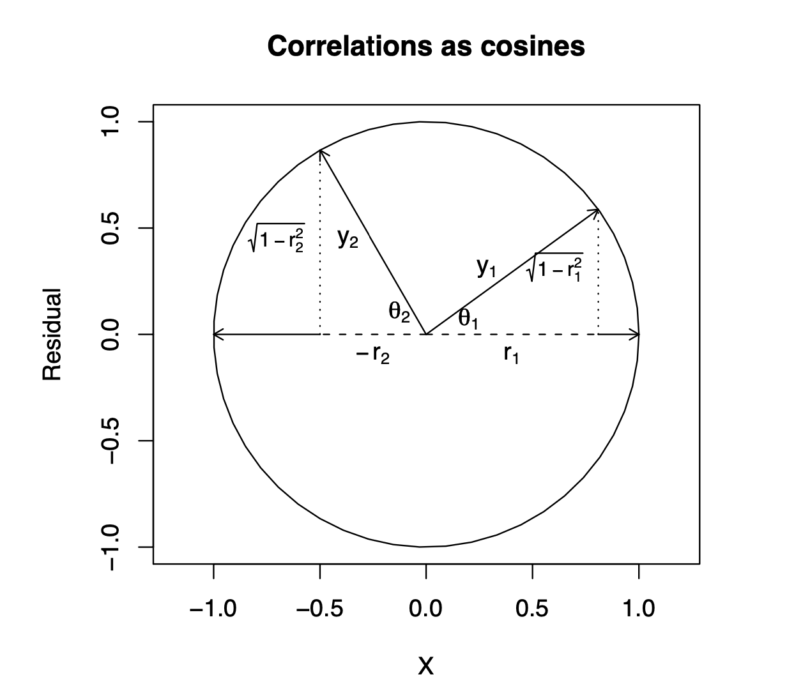

```{r, echo = F, warning = F, message = F}
library(psych)
options(scipen=999)
```


## Welcome back!

**Last term:**

- Probability, sampling, hypothesis testing
- Descriptive statistics
- A little matrix algebra

**This term:**

- Model building

--
  - Correlation and regression
  - General linear model
  - Multiple regression

---

## PSY 612 details

[UOpsych.github.io/psy612/](uopsych.github.io/psy612/)

Structure of this course:
 - Lectures, Labs, Reading 
 - Weekly quizzes (T/F)
 - Homework assignments (5, 15 points each)
 - Final project (1)
 
Journals are optional (no impact on grade)

One lab time (10:30-11:45, Fridays)

---
## Relationships

- What is the relationship between IV and DV?

- Measuring relationships depend on type of measurement

- You have primarily been working with categorical IVs (*t*-test, chi-square)

---
## Scatter Plot with best fit line
```{r,echo=FALSE, message=FALSE, cache=TRUE}
library(psych)
library(psychTools)
library(tidyverse)
library(RColorBrewer)
galton.data <- galton
purples = brewer.pal(n = 3, name = "Purples")
```

```{r, echo=FALSE, cache=TRUE, message=F, warning=F}
ggplot(galton.data, aes(x=parent, y=child)) +
    geom_jitter() +    
    geom_smooth(method=lm,   # Add linear regression line
                se=FALSE) +     # Don't add shaded confidence region
    labs(x = "parent height", y = "child height")
```

---
## Review of Dispersion

Variation (sum of squares)

$$SS = {\sum{(x-\bar{x})^2}}$$
$$SS = {\sum{(x-\mu)^2}}$$
---

## Review of Dispersion
Variance

$$\large s^{2} = {\frac{\sum{(x-\bar{x})^2}}{N-1}}$$

$$\large\sigma^{2} = {\frac{\sum{(x-\mu)^2}}{N}}$$

---

## Review of Dispersion

Standard Deviation

$$\large s = \sqrt{\frac{\sum{(x-\bar{x})^2}}{N-1}}$$

$$\large\sigma = \sqrt{\frac{\sum{(x-\mu)^2}}{N}}$$

---

class: center

Formula for standard error of the mean?

--

$$\sigma_M = \frac{\sigma}{\sqrt{N}}$$

$$\sigma_M = \frac{\hat{s}}{\sqrt{N}}$$

---
## Associations

- i.e., relationships
- to look at continuous variable associations we need to think in terms of how variables relate to one another

---
## Associations

Covariation (cross products)

**Sample:**

$$\large SS = {\sum{(x-\bar{x})(y-\bar{y})}}$$

**Population:**

$$SS = {\sum{{(x-\mu_{x}})(y-\mu_{y})}}$$

---
## Associations

Covariance

**Sample:**

$$\large cov_{xy} = {\frac{\sum{(x-\bar{x})(y-\bar{y})}}{N-1}}$$

**Population:**

$$\large \sigma_{xy}^{2} = {\frac{\sum{(x-\mu_{x})(y-\mu_{y})}}{N}}$$

--
>- Covariance matrix is basis for many analyses
>- What are some issues that may arise when comparing covariances?

---
## Associations
Correlations

**Sample:**

$$\large r_{xy} = {\frac{\sum({z_{x}z_{y})}}{N}}$$

**Population:**

$$\large \rho_{xy} = {\frac{cov(X,Y)}{\sigma_{x}\sigma_{y}}}$$


Many other formulas exist for specific types of data, these were more helpful when we computed everything by hand (more on this later).

---

## Correlations


- How much two variables are linearly related

- -1 to 1

- Invariant to changes in mean or scaling

- Most common (and basic) effect size measure

- Will use to build our regression model

---

## Correlations

```{r, echo=FALSE, cache=TRUE, , message=F, warning=F}
ggplot(galton.data, aes(x=parent, y=child)) +
    geom_jitter(alpha = .4) +
    geom_smooth(method=lm,   # Add linear regression line
                se=FALSE) +     # Don't add shaded confidence region
    labs(x = "parent height", y = "child height") +
  theme_bw(base_size = 20)
```

---

## Conceptually 

Ways to think about a correlation:

* How two vectors of numbers co-relate

* Product of z-scores
  
  + Mathematically, it is
  
* The average squared distance between two vectors in the same space

* The cosine of the angle between Y and the projected Y from X $(\hat{Y})$. 

---



---

## Statistical test

Hypothesis testing

$$\large H_{0}: \rho_{xy} = 0$$

$$\large H_{A}: \rho_{xy} \neq 0$$

Assumes:
- Observations are independent
- Symmetric bivariate distribution (joint probability distribution)

---

Univariate distributions

```{r, echo = F, message = F, warning = F, fig.width=4, fig.height=7}
library(tidyverse)
pop = ggplot(data.frame(x = seq(-30, 30)), aes(x)) +
  stat_function(fun = function(x) dnorm(x, m = 0, sd = 10),
                geom = "area", fill = purples[3]) +
  scale_x_continuous("X") +
  scale_y_continuous("density", labels = NULL) +
  ggtitle("Population")+
  theme_bw(base_size = 20)
sample = data.frame(x = rnorm(n = 30, m = 0, sd = 10)) %>%
  ggplot(aes(x = x)) +
  geom_histogram(fill = purples[2], color = "black", bins = 20) +
  scale_x_continuous("X", limits = c(-30, 30)) +
  scale_y_continuous("frequency", labels = NULL) +
  ggtitle("Sample")+
  theme_bw(base_size = 20)
sampling = ggplot(data.frame(x = seq(-30, 30)), aes(x)) +
  stat_function(fun = function(x) dnorm(x, m = 0, sd = 10/sqrt(30)),
                geom = "area", fill = purples[3]) +
  scale_x_continuous("X") +
  scale_y_continuous("density", labels = NULL) +
  ggtitle("Sampling")+
  theme_bw(base_size = 20)

ggpubr::ggarrange(pop, sample, sampling, ncol = 1)
```


---

### Population

```{r, echo=FALSE,cache=TRUE}
mu1<-0 # setting the expected value of x1
mu2<-0 # setting the expected value of x2
s11<-4 # setting the variance of x1
s12<-2 # setting the covariance between x1 and x2
s22<-5 # setting the variance of x2
rho<-0.1 # setting the correlation coefficient between x1 and x2
x1<-seq(-10,10,length=41) # generating the vector series x1
x2<-x1 # copying x1 to x2
f<-function(x1,x2)
{
term1<-1/(2*pi*sqrt(s11*s22*(1-rho^2)))
term2<--1/(2*(1-rho^2))
term3<-(x1-mu1)^2/s11
term4<-(x2-mu2)^2/s22
term5<--2*rho*((x1-mu1)*(x2-mu2))/(sqrt(s11)*sqrt(s22))
term1*exp(term2*(term3+term4-term5))
} # setting up the function of the multivariate normal density
#
z<-outer(x1,x2,f) # calculating the density values
#
persp(x1, x2, z,
main="Joint Probability Distribution", sub=expression(italic(f)~(bold(x))==frac(1,2~pi~sqrt(sigma[11]~ sigma[22]~(1-rho^2)))~phantom(0)^bold(.)~exp~bgroup("{", list(-frac(1,2(1-rho^2)),
bgroup("[", frac((x[1]~-~mu[1])^2, sigma[11])~-~2~rho~frac(x[1]~-~mu[1], sqrt(sigma[11]))~ frac(x[2]~-~mu[2],sqrt(sigma[22]))~+~ frac((x[2]~-~mu[2])^2, sigma[22]),"]")),"}")),
col= purples[3],
theta=30, phi=20,
r=50,
d=0.1,
expand=0.5,
ltheta=90, lphi=180,
shade=0.75,
ticktype="detailed",
nticks=5)

# produces the 3-D plot
mtext(expression(list(mu[1]==0,mu[2]==0,sigma[11]==4,sigma[22]==5,sigma[12 ]==2,rho==0.1)), side=3)
# adding a text line to the graph
```

---

### Sample

```{r, echo = F, message=F, warning=F}
sigma <- matrix( c( 4, 2,
                    2, 5 ), 2, 2 )  # covariance matrix

sample = BDgraph::rmvnorm(n = 30, mean = c(0,0), sigma = sigma)

sample %>% as.data.frame() %>%
  ggplot(aes(x = V1, y = V2)) +
  geom_smooth(method = "lm", se = F, color = purples[2])+
  geom_point(color = purples[3]) +
  scale_x_continuous("X1") + 
  scale_y_continuous("X2")+
  theme_bw(base_size = 20)
```

---

### Sampling distribution?

--

The sampling distribution we use depends on our null hypothesis.

--

If our null hypothesis is the nil $(\rho = 0)$ , then we can use a ***t*-distribution** to estimate the statistical significance of a correlation. 


---
## Statistical test


Test statistic

$$\large t = {\frac{r}{SE_{r}}}$$
--
.pull-left[
$$\large SE_r = \sqrt{\frac{1-r^2}{N-2}}$$

$$\large t = {\frac{r}{\sqrt{\frac{1-r^{2}}{N-2}}}}$$
]


--

.pull-right[
$$\large DF = N-2$$
]

---

## Example

You're comparing scores on the GRE Quantitative section and GRE Verbal section. You randomly select 30 applications out of those submitted to the University of Oregon and find a correlation between these scores of .80. Is this significantly different from 0?

```{r, echo = F}
r = .80
N = 30
SE = sqrt((1-r^2)/(N-2))
tstat = r/SE
cv = qt(.975, df = N-2)
```


--

$$\large SE_r = \sqrt{\frac{1-.80^2}{30-2}} = `r round(SE, 2)`$$
$$\large t = \frac{.80}{`r round(SE, 2)`} = `r round(tstat, 2)`$$
```{r}
pt(7.055, df = 30-2, lower.tail = F)*2
```


---

## Power calculations

```{r}
library(pwr)
pwr.r.test(n = , r = .1, sig.level = .05 , power = .8)
pwr.r.test(n = , r = .3, sig.level = .05 , power = .8)
```

---

## Confidence intervals

But here's where we get into some trouble. What happens if we try to estimate the precision around our estimate using the techniques we learned in PSY 611?

--

For the CI around a mean or a difference in means, we would use:
$$CI_{95} = \bar{X} \pm SE(t_{\text{critical value}})$$
```{r}
(cv = qt(.975, df = 30-2))
.80 - 0.11*cv; .80 + 0.11*cv
```


---

## Fisher's r to z' transformation


If we want to make calculations around correlation values that are not equal to 0, then we will run into a skewed sampling distribution. This applies to both calculating confidence intervals around estimates of correlations and null hypotheses in which $\rho \neq 0$.

---

## Fisher's r to z' transformation

```{r, echo = F, fig.width = 9.5}
r_sampling = function(x, r, n){
  z = fisherz(r)
  se = 1/(sqrt(n-3))
  x_z = fisherz(x)
  density = dnorm(x_z, mean = z, sd = se)
  return(density)
}

cor_75 = ggplot(data.frame(x = seq(-.99, .99)), aes(x)) +
  stat_function(fun = function(x) r_sampling(x, r = .75, 
                                             n = 30),
                geom = "area", fill = purples[3]) +
  scale_x_continuous(limits = c(-.99, .99)) +
  ggtitle("r = .75, n = 30") +
  theme_bw(base_size = 20)

cor_32 = ggplot(data.frame(x = seq(-.99, .99)), aes(x)) +
  stat_function(fun = function(x) r_sampling(x, r = .32, 
                                             n = 30),
                geom = "area", fill = purples[2]) +
  scale_x_continuous(limits = c(-.99, .99)) +
  ggtitle("r = .32, n = 30")+
  theme_bw(base_size = 20)


cor_n85 = ggplot(data.frame(x = seq(-.99, .99)), aes(x)) +
  stat_function(fun = function(x) r_sampling(x, r = -.85, 
                                             n = 30),
                geom = "area", fill = purples[3]) +
  scale_x_continuous(limits = c(-.99, .99)) +
  ggtitle("r = -.85, n = 30")+
  theme_bw(base_size = 20)

cor_75b = ggplot(data.frame(x = seq(-.99, .99)), aes(x)) +
  stat_function(fun = function(x) r_sampling(x, r = .75, 
                                             n = 150),
                geom = "area", fill = purples[3]) +
  scale_x_continuous(limits = c(-.99, .99)) +
  ggtitle("r = .75, n = 150") +
  theme_bw(base_size = 20)

cor_32b = ggplot(data.frame(x = seq(-.99, .99)), aes(x)) +
  stat_function(fun = function(x) r_sampling(x, r = .32, 
                                             n = 150),
                geom = "area", fill = purples[2]) +
  scale_x_continuous(limits = c(-.99, .99)) +
  ggtitle("r = .32, n = 150")+
  theme_bw(base_size = 20)


cor_n85b = ggplot(data.frame(x = seq(-.99, .99)), aes(x)) +
  stat_function(fun = function(x) r_sampling(x, r = -.85, 
                                             n = 150),
                geom = "area", fill = purples[3]) +
  scale_x_continuous(limits = c(-.99, .99)) +
  ggtitle("r = -.85, n = 150")+
  theme_bw(base_size = 20)


ggpubr::ggarrange(cor_n85, cor_32, cor_75, 
                  cor_n85b, cor_32b, cor_75b)
```


---
## Fisher's r to z' transformation

- Skewed sampling distribution will rear its head when:

    * $H_{0}: \rho \neq 0$

    * Calculating confidence intervals

    * Testing two correlations against one another

---

```{r, echo = F}
ggplot(data.frame(x = seq(-.99, .99)), aes(x)) +
  stat_function(fun = function(x) r_sampling(x, r = .75, 
                                             n = 30),
                geom = "area", fill = purples[3]) +
  scale_x_continuous(limits = c(-.99, .99)) +
  ggtitle("r = .75, n = 30") +
  theme_bw(base_size = 20)
```


---
## Fisher’s r to z’ transformation

- r to z':

$$\large z^{'} = {\frac{1}{2}}ln{\frac{1+r}{1-r}}$$

---
## Fisher’s r to z’ transformation

```{r, echo = F}
r = seq(-.99,.99,.01)
z = psych::fisherz(r)
data.frame(r,z) %>%
  ggplot(aes(x = r, y = z)) +
  geom_line() +
  scale_x_continuous(expr(r))+
  scale_y_continuous(expr(z_r))+
  theme_bw(base_size = 20)
```


---
##  Steps for computing confidence interval

1. Transform r into z'
2. Compute CI as you normally would using z'
3. revert back to r

$$ SE_z = \frac{1}{\sqrt{N-3}}$$

$$\large r = {\frac{e^{2z'}-1}{e^{2z'}+1}}$$
---

### Example

In a sample of 42 students, you calculate a correlation of 0.44 between hours spent outside on Saturday and self-rated health. What is the precision of your estimate?

```{r, echo = F}
r = .44
N = 42
z = fisherz(r)
se = 1/(sqrt(N-3))
ct = qt(p = .975, df = N-2, lower.tail = T)
lbz = z-(se*ct)
ubz = z+(se*ct)
lb = fisherz2r(lbz)
ub = fisherz2r(ubz)
```


.pull-left[
$$z = {\frac{1}{2}}ln{\frac{1+.44}{1-.44}} = `r round(z,2)`$$
$$SE_z = \frac{1}{\sqrt{42-3}} = `r round(se,2)`$$

$$CI_{Z_{LB}} = `r round(z,2)`-(`r round(ct,3)`)`r round(se,2)` = `r round(lbz,2)`$$

$$CI_{Z_{UB}} = `r round(z,2)`+(`r round(ct,3)`)`r round(se,2)` = `r round(ubz,2)`$$
]

---


$$CI_{r_{LB}} = {\frac{e^{2(`r round(lbz,2)`)}-1}{e^{2(`r round(lbz,2)`)}+1}} = `r round(lb,2)`$$

$$CI_{r_{UB}} = = {\frac{e^{2(`r round(ubz,2)`)}-1}{e^{2(`r round(ubz,2)`)}+1}} = `r round(ub,2)`$$

---

## Comparing two correlations

Again, we use the Fisher’s r to z’ transformation. Here, we're transforming the correlations into z's, then using the difference between z's to calculate the test statistic. 

$$Z = \frac{z_1^{'}- z_2^{'}}{se_{z_1-z_2}}$$

$$se_{z_1-z_2} = \sqrt{se_{z_1}+se_{z_2}} = \sqrt{\frac{1}{n_1-3}+\frac{1}{n_2-3}}$$
---

## Example

Replication of Hill et al. (2012) where they found that the correlation between narcissism and happiness was greater for young adults compared to older adults

.pull-left[
### Young adults
$$N = 327$$
$$r = .402$$
]

.pull-right[
### Older adults
$$N = 273$$
$$r = .283$$
]


$$H_0:\rho_1 = \rho_2$$
$$H_1:\rho_1 \neq \rho_2$$

---

```{r, echo = F}
z1 = fisherz(.402)
z2 = fisherz(.283)
n1 = 327
n2 = 273
se = sqrt(1/(n1-3) + 1/(n2-3))

zstat = (z1-z2)/se
```


$$z_1^{'} = {\frac{1}{2}}ln{\frac{1+.402}{1-.402}} = `r round(z1,3)`$$

$$z_2^{'} = {\frac{1}{2}}ln{\frac{1+.283}{1-.283}} = `r round(z2,3)`$$

$$se_{z_1-z_2} = \sqrt{\frac{1}{327-3}+\frac{1}{273-3}} = `r round(se,3)`$$

$$\text{Test statistic} = \frac{z_1^{'}-z_2^{'}}{se_{z_1-z_2}} = \frac{`r round(z1,3)`- `r round(z2,3)`}{`r round(se,3)`} = `r round(zstat,3)`$$

```{r}
pnorm(abs(zstat), lower.tail = F)*2
```

---
## Effect size

- The strength of relationship between two variables

- $\eta^2$, Cohen’s d, Cohen’s f, hedges g, $R^2$ , Risk-ratio, etc

- Significance is a function of effect size and sample size

- Statistical significance $\neq$ practical significance


---
## Questions to ask yourself:
- What is your N?
- What is the typical effect size in the field?
- Study design?
- What is your DV?
- Importance?
- Same method as IV (method variance)?

---
class: inverse

## Next time... 

More correlations
