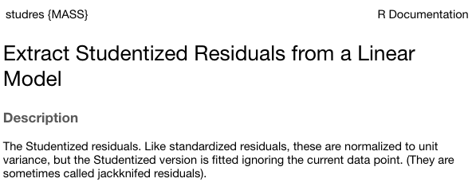

```{r, echo=F, message=FALSE, warning=FALSE}
options(scipen = 999)
library(tidyverse)
library(knitr)
# function to display only part of the output
hook_output <- knit_hooks$get("output")
knit_hooks$set(output = function(x, options) {
  lines <- options$output.lines
  if (is.null(lines)) {
    return(hook_output(x, options))  # pass to default hook
  }
  x <- unlist(strsplit(x, "\n"))
  more <- "..."
  if (length(lines)==1) {        # first n lines
    if (length(x) > lines) {
      # truncate the output, but add ....
      x <- c(head(x, lines), more)
    }
  } else {
    x <- c(more, x[lines], more)
  }
  # paste these lines together
  x <- paste(c(x, ""), collapse = "\n")
  hook_output(x, options)
})

knitr::opts_chunk$set(message = FALSE) # suppress messages
```

## Today

* Assumptions of GLM regression models
* Diagnostics
* Screening your data
* Outliers


---

## BLUE

Best Linear Unbiased Estimate of beta $(\beta)$

--
* Unbiased
* Efficient
* Consistent

???


Unbiased: what does it mean for an estimate to be biased? How did we describe the bias of variance?
Efficient: smallest standard error (best)
Consistent: as N increases, standard error decreases


---

## Assumptions of the regression model

1. No measurement error
2. Correctly specified form
3. No omitted variables
4. Homoscedasticity 
5. Independence among the residuals
6. Normally distributed residuals

---

```{r, messages = FALSE, warning= FALSE, results='hide'}
library(here)
a_data <- read.csv(here("data/anxiety.csv"))
library(broom)
model.1 <- lm(Anxiety ~ Support, a_data)
aug_1<- augment(model.1)
aug_1
```

---

## Residuals

Residuals are your best diagnostic tool for assessing your regression model. Not only can they tell you if you've violated assumptions, but they can point to specific cases that contribute to the violations. This may help you to:

* Notice patterns, which may lead you to change your theory
* Remove problematic cases
* Improve your research design

---

```{r, echo = FALSE, warning=FALSE}
library(ggplot2)
ggplot(aug_1, aes(x = Support, y = Anxiety)) +
  #geom_smooth(method = "lm", se = FALSE, color = "lightgrey") +  # Plot regression slope
  geom_segment(aes(xend = Support, yend = .fitted), alpha = .2) +  # alpha to fade lines
  geom_point() +
  geom_point(aes(y = .fitted), shape = 1) +
  scale_y_continuous(limits = c(-10, 15)) +
  labs(caption = "One predictor: Anxiety ~ Support") + 
  theme_bw(base_size = 20)
```

---

```{r, echo = FALSE}
model.2 <- lm(Anxiety ~ Support + Stress, a_data)
aug_2<- augment(model.2)

ggplot(aug_2, aes(x = Support, y = Anxiety)) +
  geom_segment(aes(xend = Support, yend = .fitted), alpha = .2) +  # alpha to fade lines
  geom_point() +
  geom_point(aes(y = .fitted), shape = 1) +
  scale_y_continuous(limits = c(-10, 15)) +
  labs(caption = "Two predictor: Anxiety ~ Support + Stress") + 
  theme_bw(base_size = 20)
```

We can add stress to the model to see how this changes

---

## 1) Measurement Error

No measurement error in our independent variables

* How does measurement error affect our coefficient estimates?

* How does measurement error affect our the standard errors of the coefficients?

* How can we check this assumption?

???

If there is measurement error, our coefficient estimates will always UNDERestimate the true parameter. This is because
$$r_{XY} = \rho\sqrt{r_{XX}r_{YY}}$$
Measurement error inflates our standard errors, because they add error

There is ALWAYS measurement error. What do we do about this?

---
## 2) Form

Assumption 2: Correctly specified form

```{r, echo = FALSE, fig.width = 10, fig.height = 5}
ggplot(data = aug_2, aes(x=.fitted, y=.resid)) + 
  geom_hline(yintercept = 0) +
  geom_point() + geom_smooth(method = "loess", se = FALSE) + 
  theme_bw(base_size = 20)
```

???

Underestimates $R^2$

---
## 3) Model

Assumption 3: Correctly specified model
- This is especially important for multiple regression. 
- Two problems: 
  
  1. "Over control" and your coefficient is no longer interpretable
  
  2. "Under control" and your coefficient is no longer interpretable
  
---
## 3) Model
### Correctly specified model

Cohen and Cohen (1983) discuss several problems associated with the inclusion of covariates/multiple independent predictors in a model. Those problems were:

1. Computational accuracy 
    * not a problem now, because computers
2. Sampling stability (tolerance)
3. Interpretation

---
## 3) Model
### Correctly specified model: Tolerance

Recall that, computationally, including multiple predictors in your model requires adjusting for the overlap in these predictors. 

$$\large se_{b} = \frac{s_{Y}}{s_{X}}\sqrt{\frac {1-R_{Y\hat{Y}}^2}{n-p-1}}\sqrt{\frac{1}{1-R_{12}^2}}$$
(in a two-predictor regression)


Tolerance is: 

$$\large 1-R_{12}^2$$

---
## 3) Model
### Correctly specified model: Tolerance

If your two independent predictors are highly correlated, tolerance gets smaller.

* As tolerance gets smaller, the standard error gets larger. This is referred to as variance inflation. The **variance inflation factor** is an index to assess this problem. 

$$\text{VIF} = \frac{1}{\text{Tolerance}} = \frac{1}{1-R^2_{12}}$$

* As the standard error becomes larger, the confidence intervals around coefficients becomes larger. When confidence intervals around estimates are large, then we say the partial coefficient estimates are *unstable.*

---
## 3) Model
### Tolerance

VIF is not bounded, but generally large numbers (greater than 5 or 10, based on who's giving you the heuristic) indicates a problem.

```{r, message = F}
library(car)
vif(model.2)
```

The lesson from tolerance is that, as you add predictors to your model, it is best to select predictors that are not correlated with each other. 

What about (3) Interpretation?
---
## 3) Model
### Lynam et al (2006)

Main takeaways:

* Partialling changes the meaning and interpretation of a variable.

* Partialling only takes variance away from the reliable $(r_{XX})$ part of a measurement.

* Nothing is a good substitute for good theory and reliable measurement.

* Always present zero-order correlations.

???

* It is difficult to know what construct an independent variable represents once the shared variance with other constructs has been removed

* PARTIALLING CHANGES VARIABLES

* Partialling only comes from the reliable part of the measurement -- if a scale has reliability .7 and correlates with another variable at .3, the partialling out the covariate removes .3 of the valid .7 variance or 9% out of 49%

    * Heterogeneous measures run the risk of greater dissimilarity following partialling.
    
Empirical work: 
~ 700 male inmates completed
PCL-R assess psychopathy (interview coding)
APSD (self-report)
PRAQ proactive and reactive aggression
EPQ
PPI also psychopathy

- partialling out sub-scales -- some correlations are even negative

Good statistics cannot overcome poor measurement and bad theory

- always present 

---

## 3) Model

### Endogeniety 

2. "Under control" and your coefficient is no longer interpretable

**Endogeniety** is when your your error term is associated with an IV. 

- Typically when you leave out an important IV.  

???

Underestimates $R^2$

---

## 3) Model

### Endogeniety 

```{r, message = F, fig.width = 10, fig.height = 5}
ggplot(aug_1, aes(x = Support, y = .resid)) +
  geom_point() + geom_smooth() +
  labs(caption = "One predictor: Anxiety ~ Support") + theme_bw(base_size = 20)
```


---

## 4) Homoscedasticity

**Homoscedasticity** is the general form of "homogeneity of variance."

.pull-left[

**Homogeneity of variance**

* the variance of an outcome is the same across two (or more) groups

* Levene's test

]

.pull-left[
**Homoscedasticity**

* the variance of an outcome is the same across all levels of all continuous predictor variables

* visual inspection of residuals by fitted values 

]

---

## 4) Homoscedasticity

```{r, echo = FALSE}
ggplot(data = aug_1, aes(x=.fitted, y=.resid)) + 
  geom_point() +
  geom_hline(yintercept = 0) +
  theme_bw(base_size = 20)
```
---

## 5) Independence among the errors

.pull-left[
```{r independence, echo = F, message = F}
aug_1$ID <- c(1:118)
ggplot(data = aug_1, 
       aes(x=ID, y = .resid)) + 
  geom_point() +  
  geom_smooth(se = F) +
  geom_hline(yintercept = 0)

```
]

.pull-right[
```{r, ref.label = "independence", eval = F}
```
]

---

## 6) Normality of the errors


```{r, fig.width = 10, fig.height = 6}
ggplot(model.1) +
  stat_qq(aes(sample = .stdresid)) +
  geom_abline() +
  theme_bw(base_size = 20)
```

---

## 6) Normality of the errors


```{r, message = F, fig.width=10}
library(car)
qqPlot(model.1)
#base plot function too
#plot(model.1, which = 2)
```


---

## Regression assumptions

|Violated Regression Assumption |	Coefficients |	Standard Errors|
|-------------------------------|--------------|-----------------|
|1. Measured without error     	|	 Biased 		 |	  Biased       |
|2. Correctly specified form 		|	 Biased 		 |	  Biased       |
|3. Correctly specified model		|	 Biased			 |	  Biased       | 
|4. Homoscedasticity 						|				       |    Biased       |
|5. Independent Errors 				 	|				       |    Biased       |
|6. Normality of the Errors 		|							 |    Biased       |

---

## How do we detect violations? 

|       Assumption              |       	Detection                    |
|-------------------------------|--------------------------------|
|1. Measured without error	    |	  Reliability                  |
|2. Correctly specified form 		|	  Residuals against predicted  |
|3. Correctly specified model		|	  Theory, endogeneity test     | 
|4. Homoscedasticity 						|		Residuals against predicted  |
|5. Independent Errors 				 	|		Research Design              |
|6. Normality of the Errors     |   q-q plot or distribution     |

---

## Violations of assumptions

How can we address violations of assumptions of regression?

|       Assumption              |       	Fix                      |
|-------------------------------|----------------------------------|
|1. Measured without error	    |	SEM, factor scores, more data, better design    |
|2. Correctly specified form 		|	Different model                  |
|3. Correctly specified model		|	 ¯`\_`(ツ)`_`/¯  & specificity analyses|
|4. Homoscedasticity 						|	Bootstraps, WLS, transformations  |
|5. Independent Errors 				 	| Use different analysis method                |
|6. Normality of the Errors     | Additional IVs, different form   |

---
## Violations of assumptions

### Robustness

Regression models are considered **robust** meaning that even when you violate assumptions, you can still use the same models with some safety.

* E.g., *t*-tests are robust to the assumption of normality, because we can fall back on the central limit theorem. 

Regression is robust to violations of *some* assumptions, primarily

  * Homoscedasticity
  * Normality of errors

---

```{r, echo = F, results = 'hide', message=FALSE}
library(tidyverse)
library(here)
a_data <- read.csv(here("data/anxiety.csv"))
library(broom)
```


## Screening your data

### Steps for screening

1) Calculate univariate and bivariate descriptive stats

  + Check the min and max 
      + make sure data were entered correctly
      + look for ceiling or floor effects

  + Check the class of the variable
      + is your grouping variable a factor or numeric?

  + Check for skew 

  + Compare correlation matrices with pairwise and listwise deletion for bias in missingness.
  
  + Calculate reliability for your scales. 
  
---

## Screening your data

### Steps for screening

2) Plot univariate and bivariate distributions
  
  + Look for skew and outliers
  
  + Check correlation heat maps for expected and unexpected patterns in items
  
---

## Screening your data

### Steps for screening

3) Test the assumptions of your regression model(s)

  + Calculate the variance inflation factor of each term (if you have two or more) to help check for correctly specified models.
  
  + Graph residuals by predictors to check for endogeniety.
  
  + Graph residuals by fitted values to check for homoscedasticity.
  
  + Graph residuals by ID number (or date, or another variable not in your model) to check for independence.
  
  + Graph the distribution of residuals or the Q-Q plot to check for normality. 
  
---

## Screening your data

### Steps for screening 

4) Look for univariate or multivariate outliers...


---

## Outliers

- Broadly defined as atypical or highly influential data point(s)

- Due to contamination (e.g. recording error) or accurate observation of a rare case

- Univariate vs. Multivariate

How do we typically describe or identify outliers? 

???

Focus on influential part -- what do we mean by influential?
How do we see the influence of outliers in the case of estimating the mean?

---

## Outliers


Outliers can be described in terms of three different metrics. Each metric conveys a sense of the magnitude of outliery-ness the case exhibits. However, some metrics also describe the degree to which your inferences will change: 

1. Leverage
    + How unusual is this case from the rest of the cases in terms of predictors?
2. Distance
    + How distant is the observed case from the predicted value?
3. Influence
    + How much the does regression coefficient change if case were removed?

---
## Outliers

### Leverage

**Leverage** tells us how far observed values for a case are from mean values on the set of IVs (centroid). 

- Not dependent on Y values

- High leverage cases have greater potential to influence regression results

---

## Outliers

### Leverage

One common metric for describing leverage is **Mahalanobis Distance**, which is the multidimensional extension of Euclidean distance where vectors are non-orthogonal. Given a set of variables, $\mathbf{X}$ with means $\mathbf{\mu}$ and covariance $\Sigma$:

$$\large D^2 = (x - \mu)' \Sigma^{-1} (x - \mu)$$ 
---

## Outliers

### Leverage

```{r}
(m = colMeans(a_data[c("Stress", "Support")], na.rm = T))
(cov = cov(a_data[c("Stress", "Support")]))
(MD = mahalanobis(x = a_data[,c("Stress", "Support")], center = m, cov = cov))
```

---

```{r, fig.width=10, fig.height=7, echo = F}
data.frame(x = 1:length(MD), MD = MD) %>%
  ggplot(aes(x = x, y = MD)) +
  geom_point() +
  geom_segment(aes(xend = x, yend = 0)) +
  scale_x_continuous("ID")+
  theme_bw(base_size = 20)
```


---
## Outliers
### Distance

- **Distance** is the distance from prediction, or how far a case's observed value is from its predicted value 

  * i.e., residual
  
  * In units of Y.
  
What might be problematic at looking at residuals in order to identify outliers?

???

Problem: outliers influence the regression line, won't be easy to spot them
  
---
## Outliers
### Distance

- Raw residuals come from a model that is influenced by the outliers, making it harder to detect the outliers in the first place. To avoid this issue, it is advisable to examine the **deleted residuals.**

  - This value represents the distance between the observed value from a predicted value _that is calculated from a regression model based on all data except the case at hand_
  
  - The leave-one-out procedure is often referred to as a "jack-knife" procedure.
  
---

### Distance


* **Standardized residuals**: takes raw residuals and puts them in a standardized unit -- this can be easier for determining cut-offs. 

$$\large z_e = \frac{e_i}{\sqrt{MSE}}$$
---

### Distance

Other residuals are available:

* **Studentized residuals**: The MSE is only an estimate of error and, especially with small samples, may be off from the population value of error by a lot. Just like we use a *t*-distribution to adjust our estimate of the standard error (of the mean) when we have a small sample, we can adjust out precision of the standard error (of the regression equation).

$$\large r_i = \frac{e_i}{\sqrt{MSE}(1-h_i)}$$

where $h_i$ is the ith element on the diagonal of the hat matrix, $\mathbf{H} = \mathbf{X}(\mathbf{X'X})^{-1}\mathbf{X}'$. As N gets larger, the difference between studentized and standardized residuals will get smaller. 
---

### Distance


**Warning:** Some textbooks (and R packages) will use terms like "standardized" and "studentized" to refer to deleted residuals that have been put in standardization units; other books and packages will not. Sometimes they switch the terms and definitions around. The text should tell you what it does. 

```{r, eval = F}
?MASS::studres
```


---

```{r, message=F, warning = F}
library(olsrr)
ols_plot_resid_stud_fit(model.2)
```

---
## Outliers
### Influence


**Influence** refers to how much a regression equation would change if the extreme case (outlier) is removed.

- Influence = Leverage X Distance

Like distance, there are several metrics by which you might assess any case's leverage. The most common are:

- Cook's Distance (change in model fit)
- DFFITS (change in fitted value, standardized)
- DFBETAS (change in coefficient estimate)

---

## Outliers
### Influence

**Cook’s Distance** is calculated by removing the ith data point from the model and recalculating the regression. It summarizes how much all the values in the regression model change when the ith observation is removed.

$$CD_i = \frac{\sum_{j=1}^n(\hat{Y}_j-\hat{Y}_{j(1)})^2}{(p+1)MSE}$$

---
### Cook's Distance

```{r, echo = FALSE}
aug_1$ID = 1:nrow(aug_1)
ggplot(aug_1, aes(x = ID, y = .cooksd)) +
geom_point() +
geom_text(aes(label = rownames(aug_1)), vjust = -1) +
  theme_bw(base_size = 20)
```

---

## Outliers

### Influence

**DFFITS** indexes how much the predicted value for a case changes if you remove the case from the equation. 

**DFBETAs** index how much the estimate for a coefficient changes if you remove a case from the equation.

```{r}
head(dffits(model.2))
head(dfbeta(model.2))
```

---

## Outliers

1. Leverage
    + How unusual is this case from the rest of the cases in terms of predictors?
2. Distance
    + How distant is the observed case from the predicted value?
3. Influence
    + How much the does regression coefficient change if case were removed?
    
Consider each of these metrics in the context of research degrees of freedom. Do some of these metrics change the independence of successive inferential tests? How might this be problematic for Type I error? 

What can you do to ensure your analysis is robust?

---
## Recommendations

- Analyze data with/without outliers and see how results change

- If you throw out cases you must believe it is not representative of population of interest or have appropriate explanation

- Don't throw out data just to be "safe". Data are hard to collect and outliers are expected!


---

## Multicollinearity

**Multicollinearity** occurs when predictor variables are highly related to each other. 
- This can be a simple relationship, such as when X1 is strongly correlated with X2. This is easy to recognize, interpret, and correct for.
- Sometimes multicollinearity is difficult to detect, such as when X1 is not strongly correlated with X2, X3, or X4, but the combination of the latter three is a strong predictor of X1. 


---

### Multicollinearity

Multicollinearity increases the standard errors of your slope coefficients.

$$\large se_{b} = \frac{s_{Y}}{s_{X}}\sqrt{\frac {1-R_{Y\hat{Y}}^2}{n-p-1}}\sqrt{\frac{1}{1-R_{12}^2}}$$
- Perfect collinearity never happens. Like everything in statistics (except rejecting the null), it's never a binary situation; there are degrees of multicollinearity. More multicollinearity = more problematic model.

---

## Multicollinearity
### Diagnosis

Multicollinearity can be diagnosed with tolerance. 

Tolerance: $1-R_{12}^2$

- Also look for models in which the coefficient of determination is large and the model is significant but the slope coefficients are small and non-significant. 

- Look for unstable slope coefficients (i.e., large standard errors)

- Look for sign changes

---

## Multicollinearity
### Ways to address

* Increase sample size

  - Remember, with small samples, our estimates can be wildly off. Even if the true relationship between X1 and X2 is small, the sample correlation might be high because of random error.
  
* Remove a variable from your model.

* Composite or factor scores

  - If variables are highly correlated because they index the same underlying construct, why not just use them to create a more precise measure of that construct?
  
---

## Suppression

Multicollinearity is related to suppression. Normally our standardized partial regression coefficients fall between 0 and $r_{Y1}$. However, it is possible for $b^*_{Y1}$ to be larger than $r_{Y1}$. We refer to this phenomenon as **suppression.**
* A non-significant $r_{Y1}$ can become a significant $b^*_{Y1}$ when additional variables are added to the model.

* A *positive* $r_{Y1}$ can become a *negative* and significant $b^*_{Y1}$.

---

## Suppression

Recall that the partial regression coefficient is calculated:

$$\large b^*_{Y1.2}=\frac{r_{Y1}-r_{Y2}r_{12}}{1-r^2_{12}}$$


--

Is suppression meaningful? 
???

Imagine a scenario when X2 and Y are uncorrelated and X2 is correlated with X1.

(Draw Venn diagram of this)

Second part of numerator becomes 0
Bottom part gets smaller
Bigger value

---

class: inverse

## Next time...

Causal models

