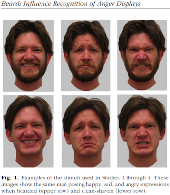

## Last time...

Introduction to interactions with two continuous predictors

---

### Recap

We use interaction terms to test the hypothesis that the relationship between X and Y changes as a function of Z. 
  - social support buffers the effect of anxiety and stress
  - conscientiousness predicts better health for affluent individuals and worse health for non-affluent individuals
  
The interaction term represents how much the slope of X changes as you increase on Z, and also how much the slope of Z changes as you increase on X. Interactions are symmetric. 

---
### Recap: Output

```{r}
cars_model = lm(mpg ~ disp*hp, data = mtcars)
summary(cars_model)
```

---
### Recap: Simple slopes

```{r, message = F}
library(reghelper)
simple_slopes(cars_model, levels = list(hp = c(78, 147, 215)))
```
---
### Recap: Plot simple slopes

```{r, message=FALSE, fig.width = 10, fig.height = 6}
library(sjPlot)
plot_model(cars_model, type = "int", mdrt.values = "meansd")
```


---

## Today

Mixing categorical and continuous predictors

Two categorical predictors

Start discussing Factorial ANOVA 

---

## Mixing categorical and continuous

Consider the case where D is a variable representing two groups. In a univariate regression, how do we interpret the coefficient for D?

$$\hat{Y} = b_{0} + b_{1}D$$

--

$b_0$ is the mean of the reference group, and D represents the difference in means between the two groups.

---

### Interpreting slopes

Extending this to the multivariate case, where X is continuous and D is a dummy code representing two groups.

$$\hat{Y} = b_{0} + b_{1}D + b_2X$$

How do we interpret $b_1?$

--


$b_1$ is the difference in means between the two groups *if the two groups have the same average level of X* or holding X constant. 

This, by the way, is ANCOVA.

---

### Visualizing

```{r, echo = F, message=F, warning = F}
library(tidyverse)
set.seed(022520)
D = rep(c(0,1), each = 10)
X = rnorm(20) + D
Y = 2*D + X + rnorm(20)

df = data.frame(X,Y,D)

means = df %>%
  group_by(D) %>%
  summarize(M = mean(Y))

mod1 = lm(Y ~ D, data = df)
predict.1 = data.frame(X = rep(mean(X),2), D = c(0,1))
predict.1$Y = predict(mod1, newdata = predict.1) 
predict.1 = cbind(predict.1[1,], predict.1[2,])
names(predict.1) = c("x1", "d1", "y1", "x2", "d2", "y2")

ggplot(df, aes(X,Y, color = as.factor(D))) +
  geom_point(size = 3) +
  geom_hline(aes(yintercept = M, color = as.factor(D)), 
             data = means, size = 1.5) + 
  geom_segment(aes(x = x1, y = y1, xend = x2, yend = y2), data = predict.1, 
               inherit.aes = F, size = 1.5)+
  labs(color = "D") +
  cowplot::theme_cowplot()
```

---
### Visualizing
```{r, echo = F}
mod = lm(Y ~ X + D, data = df)
df$pmod = predict(mod)

predict.2 = data.frame(X = rep(mean(X)+.1,2), D = c(0,1))
predict.2$Y = predict(mod, newdata = predict.2) 
predict.2 = cbind(predict.2[1,], predict.2[2,])
names(predict.2) = c("x1", "d1", "y1", "x2", "d2", "y2")

ggplot(df, aes(X,Y, color = as.factor(D))) +
  geom_point(size = 3) +
  geom_smooth(aes(y = pmod), method = "lm", se = F)+
  labs(color = "D") +
  geom_segment(aes(x = x1, y = y1, xend = x2, yend = y2), data = predict.2, 
               inherit.aes = F, size = 1.5)+
  cowplot::theme_cowplot()
```

---
### Visualizing
```{r, echo = F}
mod = lm(Y ~ X + D, data = df)
df$pmod = predict(mod)

predict.2 = data.frame(X = rep(mean(X)+.1,2), D = c(0,1))
predict.2$Y = predict(mod, newdata = predict.2) 
predict.2 = cbind(predict.2[1,], predict.2[2,])
names(predict.2) = c("x1", "d1", "y1", "x2", "d2", "y2")

ggplot(df, aes(X,Y, color = as.factor(D))) +
  geom_point(size = 3) +
  geom_smooth(aes(y = pmod), method = "lm", se = F)+
  labs(color = "D") +
  geom_segment(aes(x = x1, y = y1, xend = x2, yend = y2), data = predict.1, 
               inherit.aes = F, size = 1.5)+
  geom_segment(aes(x = x1, y = y1, xend = x2, yend = y2), data = predict.2, 
               inherit.aes = F, size = 1.5)+
  cowplot::theme_cowplot()
```
---

### 3 or more groups

We might be interested in the relative contributions of our two variables, but we have to remember that they're on different scales, so we cannot compare them using the unstandardized regression coefficient.

Standardized coefficients can be used if we only have two groups, but what if we have 3 or more?

--

Just like we use $R^2$ to report how much variance in Y is explained by the model, we can break this down into the unique contributions of each variable in the model, including factors with 3+ levels. 

$$\large \eta^2 = \frac{SS_{\text{Variable}}}{SS_{Y}}== \frac{SS_{\text{Variable}}}{SS_{\text{Total}}}$$

---


```{r}
mod = lm(Y ~ X + D, data = df)
anova(mod)
```

$$\large \eta^2_{X} = \frac{64.045}{64.045+20.071+17.707} = .62899 = 63\%$$
$$\large \eta^2_{D} = \frac{20.071}{64.045+20.071+17.707} = .19712 = 20\%$$

---

## Interactions

Now extend this example to include joint effects, not just additive effects:

$$\hat{Y} = b_{0} + b_{1}D + b_2X + b_3DX$$

How do we interpret $b_1?$

--

$b_1$ is the difference in means between the two groups *when X is 0*.

What is the interpretation of $b_2$?

--

$b_2$ is the slope of X among the reference group.

What is the interpretation of $b_3?$

--

$b_3$ is the difference in slopes between the reference group and the other group.

---

### Visualizing

```{r, echo = F, fig.width=10, fig.height=6}
ggplot(df, aes(X,Y, color = as.factor(D))) +
  geom_point(size = 3) +
  geom_smooth(method = "lm", se = F)+
  labs(color = "D") +
  cowplot::theme_cowplot()
```

Where should we draw the segment to compare means?

???

Where you draw the segment changes the difference in means. That's why $b_1$ can only be interpreted as the difference in means when X = 0.

---

## Example 

A recent study by [Craig, Nelson, & Dixson, 2019](https://journals.sagepub.com/doi/full/10.1177/0956797619834876) examined whether the presence or absence of a beard made it easier to decode a man's facial expression. In this study, participants were presented with photographs of bearded and clean-shaven men making expressive faces.

.pull-left[

]

.pull-right[
Participants were asked to categorize each face as "happy" or "angry" as quickly as possible. Reaction time (in ms) was the outcome. 
]

---
.pull-left[
I want to know whether men who are good at identifying angry expressions of clean-shaven men are also good at identifying angry expressions of bearded men. 

I also want to know if that relationship differs among men (participants) who are bearded.
]

.pull-right[

]

---

### `R` code

```{r, message = F, warning = F}
library(here)
beards = read.csv(here("data/beards.csv"), stringsAsFactors = F)
```

```{r, echo = F}
beards = beards %>% 
  filter(beard %in% c("No","Yes")) %>%
  mutate(beard = factor(beard, levels = c("No", "Yes")))
```

```{r, message = F, warning = F}
library(psych)
table(beards$beard)
describe(beards[,c("BA_mean", "CA_mean")], fast = T)
```

---
### Model summary

```{r}
beard.mod = lm(BA_mean ~ CA_mean*beard, data = beards)
summary(beard.mod)
```
---

### Plotting results

```{r, message = F, warning = F, fig.width=10, fig.height=6}
library(sjPlot)
plot_model(beard.mod, type = "int", show.data = T, axis.title = c("Response to clean-shaven faces (in milliseconds)", "Response to bearded faces (in milliseconds)"), legend.title = "Participant beard?", title = "Smaller difference in reaction to clean-shaven and bearded faces among clean-shaven participants", wrap.title = T)
```

---

## Two categorical predictors

If both X and M are categorical variables, the interpretation of coefficients is no longer the value of means and slopes, but means and differences in means. 

Recall our Solomon's paradox example from a few weeks ago:

```{r}
solomon = read.csv(here("data/solomon.csv"))
```
```{r, echo = F}
solomon$PERSPECTIVE = ifelse(solomon$CONDITION %in% c(1,2), "self", "other")
solomon$DISTANCE = ifelse(solomon$CONDITION %in% c(1,3), "immersed", "distanced")
```
```{r}
head(solomon[,c("PERSPECTIVE", "DISTANCE", "WISDOM")])
```
---

### Model summary

```{r, highlight.output = 11}
solomon.mod = lm(WISDOM ~ PERSPECTIVE*DISTANCE, data = solomon)
summary(solomon.mod)
```

---

### Model summary
```{r, highlight.output = 12}
solomon.mod = lm(WISDOM ~ PERSPECTIVE*DISTANCE, data = solomon)
summary(solomon.mod)
```

---

### Model summary
```{r, highlight.output = 13}
solomon.mod = lm(WISDOM ~ PERSPECTIVE*DISTANCE, data = solomon)
summary(solomon.mod)
```

---

### Model summary
```{r, highlight.output = 14}
solomon.mod = lm(WISDOM ~ PERSPECTIVE*DISTANCE, data = solomon)
summary(solomon.mod)
```

---

### Model summary
```{r, highlight.output = 21}
solomon.mod = lm(WISDOM ~ PERSPECTIVE*DISTANCE, data = solomon)
summary(solomon.mod)
```

---

### Plotting results
```{r, fig.width=9, fig.height=6}
plot_model(solomon.mod, type = "int")
```

---
class:inverse
## Factorial ANOVA


The interaction of two or more categorical variables in a general linear model is formally known as **Factorial ANOVA**.

A factorial design is used when there is an interest in how two or more variables (or factors) affect the outcome. 

* Rather than conduct separate one-way ANOVAs for each factor, they are all included in one analysis. 

* The unique and important advantage to a factorial ANOVA over separate one-way ANOVAs is the ability to examine interactions.

---

```{r, echo = F}
set.seed(23)
SD=120

DV_Slow_N <- rnorm(20,mean=600,sd=SD) # draw 20 from normal distribution
DV_Slow_C <- rnorm(20,mean=590,sd=SD) # draw 20 from normal distribution
DV_Slow_U <- rnorm(20,mean=585,sd=SD) # draw 20 from normal distribution

DV_Med_N <- rnorm(20,mean=550,sd=SD) # draw 20 from normal
DV_Med_C <- rnorm(20,mean=450,sd=SD) # draw 20 from normal
DV_Med_U <- rnorm(20,mean=300,sd=SD) # draw 20 from normal

DV_Fast_N <- rnorm(20,mean=310,sd=SD) # draw 20 from normal
DV_Fast_C <- rnorm(20,mean=305,sd=SD) # draw 20 from normal
DV_Fast_U <- rnorm(20,mean=290,sd=SD) # draw 20 from normal

# put DVs together in a data frame; specify Speed and Noise Values
Data = data.frame(Time = c(DV_Slow_N,
                           DV_Slow_C,
                           DV_Slow_U,
                           DV_Med_N,
                           DV_Med_C,
                           DV_Med_U,
                           DV_Fast_N,
                           DV_Fast_C,
                           DV_Fast_U),
                  Speed = rep(c("Slow", "Medium", "Fast"), each = 60),
                  Noise = rep(rep(c("None", "Controllable", "Uncontrollable"), 
                                  each = 20), 3)) #repeat each label 20 times, then repeat that whole sequence 3 times
Data$Speed = factor(Data$Speed, levels = c("Slow", "Medium", "Fast")) # set order of levels as I want them presented
Data$Noise = factor(Data$Noise, levels = c("None", "Controllable", "Uncontrollable")) # set order of levels as I want them presented
```

.pull-left[
The example data are from a simulated study in which 180 participants performed an eye-hand coordination task in which they were required to keep a mouse pointer on a red dot that moved in a circular motion.  
]
.pull-right[

]

The outcome was the time of the 10th failure. The experiment used a completely crossed, 3 x 3 factorial design. One factor was dot speed: .5, 1, or 1.5 revolutions per second.  The second factor was noise condition.  Some participants performed the task without any noise; others were subjected to periodic and unpredictable 3-second bursts of 85 dB white noise played over earphones.  Of those subjected to noise, half could do nothing to stop the noise (uncontrollable noise); half believed they could stop the noise by pressing a button (controllable noise).

---

### Terminology 

In a **completely crossed** factorial design, each level of one factor occurs in combination with each level of the other factor.

If equal numbers of participants occur in each combination, the design is **balanced**.  This has some distinct advantages (described later). 

| | Slow | Medium | Fast |
|:-|:-:|:-:|:-:|
| No Noise | X | X | X |
| Controllable Noise | X | X | X |
| Uncontrollable Noise | X | X | X |

---

### Terminology

We describe the factorial ANOVA design by the number of **levels** of each **factor.** 

  - Factor: a variable that is being manipulated or in which there are two or more groups
  
  - Level: the different groups within a factor

In this case, we have a 3 x 3 ANOVA ("three by three"), because our first factor (speed) has three levels (slow, medium, and fast) and our second factor (noise) also has three levels (none, controllable, and uncontrollable)

---

### Questions 
```{r, echo = F, results = 'asis', message = F, warning = F}
mean.summary = Data %>%
  group_by(Noise, Speed) %>%
  summarize(Time = mean(Time)) %>%
  spread("Speed", "Time")
mean.summary$Noise = as.character(mean.summary$Noise)
mean.summary$Marginal = rowMeans(mean.summary[2:4])
mean.summary[4,1] = "Marginal"
mean.summary[4,2:5] = colMeans(mean.summary[2:5], na.rm=T)
library(knitr)
library(kableExtra)
kable(mean.summary, digits = 2) %>% kable_styling() %>% group_rows(start_row = 1, end_row = 3)
```


There are three important ways we can view the results of this experiment.  Two of them correspond to questions that would arise in a simple one-way ANOVA:

Regardless of noise condition, does speed of the moving dot affect performance?

Regardless of dot speed, does noise condition affect performance?

---

### Marginal means

```{r, echo = F, results = 'asis', message = F, warning = F}
kable(mean.summary, digits = 2) %>% 
  kable_styling() %>% 
  group_rows(start_row = 1, end_row = 3) %>%
  row_spec(4, bold = T, color = "white", background = "#562457")
```

We can answer those questions by examining the marginal means, which isolate one factor while collapsing across the other factor.

Regardless of noise condition, does speed of the moving dot affect performance?  Faster moving dots are harder to track and lead to faster average failure times.

Adding information about variability allows us a sense of whether these are significant and meaningful differences...

---

```{r, message = F, warning = F, fig.width = 10, fig.height = 4.5}
library(ggpubr)
ggbarplot(data = Data, x = "Speed", y = "Time", add = c("mean_ci"), fill = "#562457", xlab = "Speed Condition", ylab = "Mean Seconds (95% CI)", title = "Failure time as a function of\nspeed condition") + cowplot::theme_cowplot(font_size = 20)
```

Looks like the mean differences are substantial.  The ANOVA will be able to tell us if the means are significantly different  and the magnitude of those differences in terms of variance accounted for.

---

### Marginal means

```{r, echo = F, results = 'asis', message = F, warning = F}
kable(mean.summary, digits = 2) %>% 
  kable_styling() %>% 
  group_rows(start_row = 1, end_row = 3) %>% 
  column_spec(5, bold = T, color = "white", background = "#562457")
```

Regardless of dot speed, does noise condition affect performance?  Performance declines in the presence of noise, especially if the noise is uncontrollable.

Here, too adding information about variability allows us a sense of whether these are significant and meaningful differences...

---

```{r, message = F, warning = F, fig.width = 10, fig.height = 4.5}
ggbarplot(data = Data, x = "Noise", y = "Time", add = c("mean_ci"), fill = "#562457", xlab = "Noise Condition", ylab = "Mean Seconds (95% CI)", title = "Failure time as a function of\nnoise condition") + cowplot::theme_cowplot(font_size = 20)
```

The mean differences are not as apparent for this factor. The ANOVA will be particularly important for informing us about statistical significance and effect size.

---

### Marginal means

```{r, echo = F, results = 'asis', message = F, warning = F}
kable(mean.summary, digits = 2) %>% 
  kable_styling() %>% 
  group_rows(start_row = 1, end_row = 3) 
```
The **marginal mean differences** correspond to main effects. They tell us what impact a particular factor has, ignoring the impact of the other factor. 

The remaining effect in a factorial design, and it primary advantage over separate one-way ANOVAs, is the ability to examine **conditional mean differences**. 

---

### One-way vs Factorial

.pull-left[
**Marginal Mean Differences**

Results of one-way ANOVA

```{r, eval = F}
lm(y ~ GROUP)
```

$$\hat{Y} = b_0 + b_1D$$

]

.pull-left[
**Conditional Mean Differences**

Results of Factorial ANOVA

```{r, eval = F}
lm(y ~ GROUP*other_VARIABLE)
```

$$\hat{Y} = b_0 + b_1D + b_2O + b_3DO$$

]

---

class: inverse

## Next time

More Factorial ANOVA