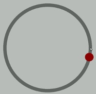
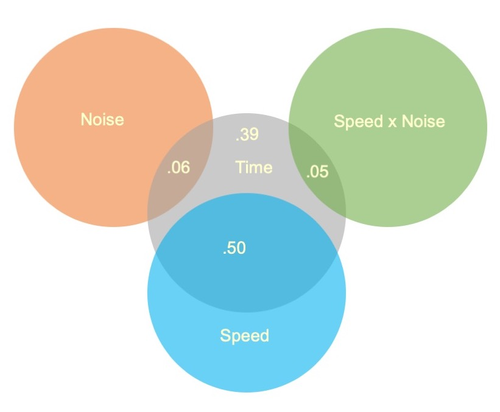
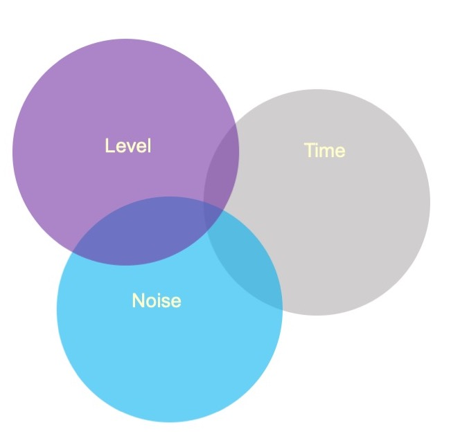
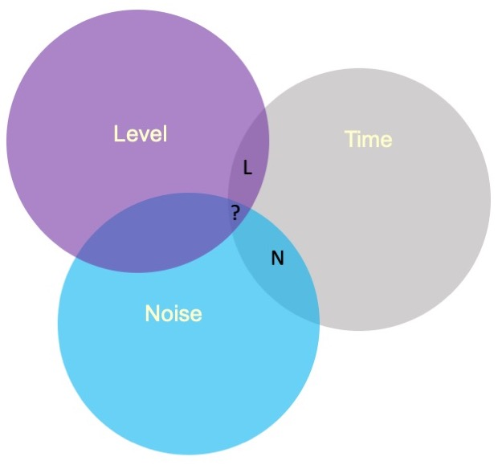
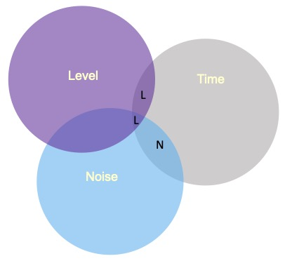

class:inverse
## Factorial ANOVA


The interaction of two or more categorical variables in a general linear model is formally known as **Factorial ANOVA**.

A factorial design is used when there is an interest in how two or more variables (or factors) affect the outcome. 

* Rather than conduct separate one-way ANOVAs for each factor, they are all included in one analysis. 

* The unique and important advantage to a factorial ANOVA over separate one-way ANOVAs is the ability to examine interactions.
```{r, echo = F, message = F, warning = F}
library(tidyverse)
library(knitr)
library(kableExtra)
library(here)
```

---

```{r, echo = F}
set.seed(23)
SD=120

DV_Slow_N <- rnorm(20,mean=600,sd=SD) # draw 20 from normal distribution
DV_Slow_C <- rnorm(20,mean=590,sd=SD) # draw 20 from normal distribution
DV_Slow_U <- rnorm(20,mean=585,sd=SD) # draw 20 from normal distribution

DV_Med_N <- rnorm(20,mean=550,sd=SD) # draw 20 from normal
DV_Med_C <- rnorm(20,mean=450,sd=SD) # draw 20 from normal
DV_Med_U <- rnorm(20,mean=300,sd=SD) # draw 20 from normal

DV_Fast_N <- rnorm(20,mean=310,sd=SD) # draw 20 from normal
DV_Fast_C <- rnorm(20,mean=305,sd=SD) # draw 20 from normal
DV_Fast_U <- rnorm(20,mean=290,sd=SD) # draw 20 from normal

# put DVs together in a data frame; specify Speed and Noise Values
Data = data.frame(Time = c(DV_Slow_N,
                           DV_Slow_C,
                           DV_Slow_U,
                           DV_Med_N,
                           DV_Med_C,
                           DV_Med_U,
                           DV_Fast_N,
                           DV_Fast_C,
                           DV_Fast_U),
                  Speed = rep(c("Slow", "Medium", "Fast"), each = 60),
                  Noise = rep(rep(c("None", "Controllable", "Uncontrollable"), 
                                  each = 20), 3)) #repeat each label 20 times, then repeat that whole sequence 3 times
Data$Speed = factor(Data$Speed, levels = c("Slow", "Medium", "Fast")) # set order of levels as I want them presented
Data$Noise = factor(Data$Noise, levels = c("None", "Controllable", "Uncontrollable")) # set order of levels as I want them presented
write.csv(Data, file = here("data/hand_eye_task.csv")) # save data to a CSV file
```

.pull-left[
The example data are from a simulated study in which 180 participants performed an eye-hand coordination task in which they were required to keep a mouse pointer on a red dot that moved in a circular motion.  
]
.pull-right[

]

The outcome was the time of the 10th failure. The experiment used a completely crossed, 3 x 3 factorial design. One factor was dot speed: .5, 1, or 1.5 revolutions per second.  The second factor was noise condition: no noise, controllable noise, and uncontrollable noise.  The design was balanced. 

---

### Marginal means

```{r, echo = F, results = 'asis', message = F, warning = F}
mean.summary = Data %>%
  group_by(Noise, Speed) %>%
  summarize(Time = mean(Time)) %>%
  spread("Speed", "Time")
mean.summary$Noise = as.character(mean.summary$Noise)
mean.summary$Marginal = rowMeans(mean.summary[2:4])
mean.summary[4,1] = "Marginal"
mean.summary[4,2:5] = as.list(colMeans(mean.summary[2:5], na.rm=T))

kable(mean.summary, digits = 2) %>% 
  kable_styling() %>% 
  group_rows(start_row = 1, end_row = 3) %>%
  row_spec(4, bold = T, color = "white", background = "#562457")
```

Regardless of noise condition, does speed of the moving dot affect performance?

---

### Marginal means

```{r, echo = F, results = 'asis', message = F, warning = F}
kable(mean.summary, digits = 2) %>% 
  kable_styling() %>% 
  group_rows(start_row = 1, end_row = 3) %>% 
  column_spec(5, bold = T, color = "white", background = "#562457")
```

Regardless of dot speed, does noise condition affect performance?


---

### Marginal means

```{r, echo = F, results = 'asis', message = F, warning = F}
kable(mean.summary, digits = 2) %>% 
  kable_styling() %>% 
  group_rows(start_row = 1, end_row = 3) 
```
The **marginal mean differences** correspond to main effects. They tell us what impact a particular factor has, ignoring the impact of the other factor. 

The remaining effect in a factorial design, and it primary advantage over separate one-way ANOVAs, is the ability to examine **conditional mean differences**. 

---


### Mean differences

```{r, echo = F, results = 'asis', message = F, warning = F}
kable(mean.summary, digits = 2) %>% 
  kable_styling() %>% 
  group_rows(start_row = 1, end_row = 3) %>%
  column_spec(2, background = "#EECACA") %>%
  column_spec(3, background = "#B2D4EB") %>%
  column_spec(4, background = "#FFFFC5") %>%
  column_spec(5, background = "grey", color = "white") %>%
  row_spec(4, background = "white")
```

Are the marginal mean differences for noise condition a good representation of what is happening within each of the dot speed conditions?

If not, then we would need to say that the noise condition effect depends upon (is conditional on) dot speed.  We would have an interaction between noise condition and dot speed condition.

---


```{r, message = F, warning = F, fig.width = 10, fig.height = 5, echo = F}
library(sjPlot)
library(tidyverse)
model = lm(Time ~Speed*Noise, data = Data)
model.data = plot_model(model, type = "int")$data
model.data %>% ggplot(aes(x = x, y = predicted, fill = group)) +
  geom_bar(stat = "identity", position = position_dodge(width = .8), color = "black", width = .7) +
  geom_errorbar(aes(ymin = conf.low, ymax = conf.high), width = .3, position = position_dodge(width = .8)) +
  scale_x_continuous("Speed Condition", breaks = c(1, 2,3), labels = c("Slow", "Medium", "Fast")) +
  labs(y = "Mean Seconds (95% CI)", fill = "Noise Condition", title = "Failure time as a function of\nnoise condition and speed condition") +
cowplot::theme_cowplot(font_size = 20)
```


The noise condition means are most distinctly different in the medium speed condition. The noise condition means are clearly not different in the fast speed condition. 

---

### Interpretation of interactions

The presence of an interaction qualifies any main effect conclusions, leading to "yes, but" or "it depends" kinds of inferences.

.pull-left[

```{r, message = F, warning = F, fig.width = 5, fig.height = 3,echo =F}
model.data %>% ggplot(aes(x = x, y = predicted, fill = group)) +
  geom_bar(stat = "identity", position = position_dodge(width = .8), color = "black", width = .7) +
  geom_errorbar(aes(ymin = conf.low, ymax = conf.high), width = .3, position = position_dodge(width = .8)) +
  scale_x_continuous("Speed Condition", breaks = c(1, 2,3), labels = c("Slow", "Medium", "Fast")) +
  labs(y = "Mean Seconds (95% CI)", fill = "Noise Condition", title = "Failure time as a function of\nnoise condition and speed condition") +
cowplot::theme_cowplot(font_size = 10)
```

]

.pull-right[

Does noise condition affect failure time? 

"Yes, but the magnitude of the effect is strongest for the medium speed condition, weaker for the fast speed condition, and mostly absent for the slow speed condition."
]

---

### Interactions are symmetrical

```{r, echo = F, results = 'asis', message = F, warning = F}
kable(mean.summary, digits = 2) %>% 
  kable_styling() %>% 
  group_rows(start_row = 1, end_row = 3) %>%
  row_spec(1, background = "#EECACA") %>%
  row_spec(2, background = "#B2D4EB") %>%
  row_spec(3, background = "#FFFFC5") %>%
  row_spec(4, background = "grey", color = "white") %>%
  column_spec(5, background = "white")
```

Are the marginal mean differences for speed condition a good representation of what is happening within each of the noise conditions?

If not, then we would need to say that the speed condition effect depends upon (is conditional on) noise condition.  


---

.left-column[
.small[
The speed condition means are clearly different in each noise condition, but the pattern of those differences is not the same. 

The marginal speed condition means do not represent well the means in each noise condition.

An interaction.]

]

```{r, message = F, warning = F, fig.width = 7, fig.height = 8.5, echo = F}
model.data %>% ggplot(aes(x = group, y = predicted, fill = as.factor(x))) +
  geom_bar(stat = "identity", position = position_dodge(width = .8), color = "black", width = .7) +
  geom_errorbar(aes(ymin = conf.low, ymax = conf.high), width = .3, position = position_dodge(width = .8)) +
  scale_x_discrete("Noise Condition") +
  scale_fill_discrete("Speed Condition", labels = c("Slow", "Medium", "Fast"))+
  labs(y = "Mean Seconds (95% CI)", title = "Failure time as a function of\nnoise condition and speed condition") +
cowplot::theme_cowplot(font_size = 20) + theme(legend.position = "top")
```
---

### Null Hypotheses

| | Slow | Medium | Fast | Marginal |
|:-|:-:|:-:|:-:|:-:|
| No Noise |             $\mu_{11}$ | $\mu_{12}$ | $\mu_{13}$ | $\mu_{1.}$ |
| Controllable Noise |   $\mu_{21}$ | $\mu_{22}$ | $\mu_{23}$ | $\mu_{2.}$ |
| Uncontrollable Noise | $\mu_{31}$ | $\mu_{32}$ | $\mu_{33}$ | $\mu_{3.}$ |
| Marginal | $\mu_{.1}$ | $\mu_{.2}$ | $\mu_{.3}$ | $\mu_{..}$ |

The two main effects and the interaction represent three independent questions we can ask about the data. We have three null hypotheses to test.

One null hypothesis refers to the marginal row means.

$$
\begin{aligned}
\large H_0&: \mu_{1.} = \mu_{2.} = \dots = \mu_{R.}\\
H_1&: \text{Not true that }\mu_{1.} = \mu_{2.} = \dots = \mu_{R.}
\end{aligned}
$$

---

### Null Hypotheses

| | Slow | Medium | Fast | Marginal |
|:-|:-:|:-:|:-:|:-:|
| No Noise |             $\mu_{11}$ | $\mu_{12}$ | $\mu_{13}$ | $\mu_{1.}$ |
| Controllable Noise |   $\mu_{21}$ | $\mu_{22}$ | $\mu_{23}$ | $\mu_{2.}$ |
| Uncontrollable Noise | $\mu_{31}$ | $\mu_{32}$ | $\mu_{33}$ | $\mu_{3.}$ |
| Marginal | $\mu_{.1}$ | $\mu_{.2}$ | $\mu_{.3}$ | $\mu_{..}$ |

We can state this differently (it will make stating the interaction null hypothesis easier when we get to it).

$$
\begin{aligned}
\large \alpha_r&= \mu_{r.} - \mu_{..} \\
\large H_0&: \alpha_1 = \alpha_2 = \dots = \alpha_R = 0\\
H_1&: \text{At least one }\alpha_r \neq 0
\end{aligned}
$$

---

### Null Hypotheses


| | Slow | Medium | Fast | Marginal |
|:-|:-:|:-:|:-:|:-:|
| No Noise |             $\mu_{11}$ | $\mu_{12}$ | $\mu_{13}$ | $\mu_{1.}$ |
| Controllable Noise |   $\mu_{21}$ | $\mu_{22}$ | $\mu_{23}$ | $\mu_{2.}$ |
| Uncontrollable Noise | $\mu_{31}$ | $\mu_{32}$ | $\mu_{33}$ | $\mu_{3.}$ |
| Marginal | $\mu_{.1}$ | $\mu_{.2}$ | $\mu_{.3}$ | $\mu_{..}$ |

The main effect for dot speed (column marginal means) can be stated similarly:


$$
\begin{aligned}
\large \beta_c&= \mu_{.c} - \mu_{..} \\
\large H_0&: \beta_1 = \beta_2 = \dots = \beta_C = 0\\
H_1&: \text{At least one }\beta_c \neq 0
\end{aligned}
$$

---

### Null Hypothesis


| | Slow | Medium | Fast | Marginal |
|:-|:-:|:-:|:-:|:-:|
| No Noise |             $\mu_{11}$ | $\mu_{12}$ | $\mu_{13}$ | $\mu_{1.}$ |
| Controllable Noise |   $\mu_{21}$ | $\mu_{22}$ | $\mu_{23}$ | $\mu_{2.}$ |
| Uncontrollable Noise | $\mu_{31}$ | $\mu_{32}$ | $\mu_{33}$ | $\mu_{3.}$ |
| Marginal | $\mu_{.1}$ | $\mu_{.2}$ | $\mu_{.3}$ | $\mu_{..}$ |

The interaction null hypothesis can then be stated as follows:

$$
\begin{aligned}
\large (\alpha\beta)_{rc}&= \mu_{rc} - \alpha_r - \beta_c  - \mu_{..} \\
\large H_0&: (\alpha\beta)_{11} = (\alpha\beta)_{12} = \dots = (\alpha\beta)_{RC} = 0\\
H_1&: \text{At least one }(\alpha\beta)_{rc} \neq 0
\end{aligned}
$$
---

### Variability 

As was true for the simpler one-way ANOVA, we will partition the total variability in the data matrix into two basic parts. 

One part will represent variability **within groups**.  This within-group variability is variability that has nothing to do with the experimental conditions (all participants within a particular group experience the same experimental conditions). 

The other part will be **between-group variability**.  This part will include variability due to experimental conditions.  We will further partition this between-group variability into parts due to the two main effects and the interaction.

---

### Variability 


$$
\begin{aligned}
\large SS_{\text{total}} &= \sum_{r=1}^R\sum_{c=1}^C\sum_{i=1}^{N_{rc}}(Y_{rci}-\bar{Y}_{...})^2 \\
\large SS_{\text{Within}} &= \sum_{r=1}^R\sum_{c=1}^C\sum_{i=1}^{N_{rc}}(Y_{rci}-\bar{Y}_{rc.})^2 \\
\large SS_R &= CN\sum_{r=1}^R(\bar{Y}_{r..}-\bar{Y}_{...})^2\\
SS_C &= RN\sum_{c=1}^C(\bar{Y}_{.c.}-\bar{Y}_{...})^2\\
\large SS_{RC} &= \sum_{r=1}^R\sum_{c=1}^C\sum_{i=1}^{N_{rc}}(\bar{Y}_{rc.}-\bar{Y}_{r..}-\bar{Y}_{.c.}+\bar{Y}_{...})^2 \\
\end{aligned}
$$
---

### Variability 


$$
\begin{aligned}
\large SS_{\text{total}} &= \sum_{r=1}^R\sum_{c=1}^C\sum_{i=1}^{N_{rc}}(Y_{rci}-\bar{Y}_{...})^2 \\
\large SS_{\text{Within}} &= \sum_{r=1}^R\sum_{c=1}^C\sum_{i=1}^{N_{rc}}(Y_{rci}-\bar{Y}_{rc.})^2 \\
\large SS_R &= CN\sum_{r=1}^R(\bar{Y}_{r..}-\bar{Y}_{...})^2\\
SS_C &= RN\sum_{c=1}^C(\bar{Y}_{.c.}-\bar{Y}_{...})^2\\
\large SS_{RC} &= N\sum_{r=1}^R\sum_{c=1}^C(\bar{Y}_{rc.}-\bar{Y}_{r..}-\bar{Y}_{.c.}+\bar{Y}_{...})^2 \\
\end{aligned}
$$
---


### Variability 


If the design is balanced (equal cases in all conditions), then:

$$\large SS_{\text{total}} = SS_{\text{within}} + SS_R + SS_C + SS_{RxC}$$

$df$, $MS$, and $F$ ratios are defined in the same way as they were for one-way ANOVA. We just have more of them.
$$
\begin{aligned}
\large df_R &= R-1 \\
\large df_C &= C-1 \\
\large df_{RxC} &= (R-1)(C-1) \\
\large df_{within} &= N-G \\
&= N-(R-1)-(C-1)-[(R-1)(C-1)]-1\\
&= df_{total} - df_{R} - df_C - df_{RxC}
\end{aligned}
$$

---

### Variability 

If the design is balanced (equal cases in all conditions), then:

$$\large SS_{\text{total}} = SS_{\text{within}} + SS_R + SS_C + SS_{RxC}$$

$df$, $MS$, and $F$ ratios are defined in the same way as they were for one-way ANOVA. We just have more of them.

.pull-left[
$$
\begin{aligned}
\large MS_R &= \frac{SS_R}{df_R} \\
\large MS_C &= \frac{SS_C}{df_C} \\
\large MS_{RxC} &= \frac{SS_{RxC}}{df_{RxC}} \\
\large MS_{within} &= \frac{SS_{within}}{df_{within}} \\
\end{aligned}
$$
]

.pull-right[

Each mean square is a variance estimate.  $MS_{within}$  is the pooled estimate of the within-groups variance.  It represents only random or residual variation.  $MS_R$, $MS_C$, and $MS_{RxC}$ also contain random variation, but include systematic variability too.

]

---

### F-statistics 


If the design is balanced (equal cases in all conditions), then:

$$\large SS_{\text{total}} = SS_{\text{within}} + SS_R + SS_C + SS_{RxC}$$

$df$, $MS$, and $F$ ratios are defined in the same way as they were for one-way ANOVA. We just have more of them.

.pull-left[
$$
\begin{aligned}
\large F_R &= \frac{MS_R}{MS_{within}} \\
\\
\large F_C &= \frac{MS_C}{MS_{within}} \\
\\
\large F_{RxC} &= \frac{MS_{RxC}}{MS_{within}} \\
\end{aligned}
$$

]

.pull-right[
If the null hypotheses are true, these ratios will be ~1.00 because the numerator and denominator of each estimate the same thing. Departures from 1.00 indicate that systematic variability is present. If large enough, we reject the null hypothesis (each considered separately).
]

---

### Degrees of freedom

The degrees of freedom for the different F ratios might not be the same. Different degrees of freedom define different theoretical F density distributions for determining what is an unusual value under the null hypothesis.


Which is to say, you might get the same F-ratio for two different tests, but they could have different p-values, if they represent different numbers of groups. 

---

### Interpretation of significance tests

```{r}
fit = lm(Time ~ Speed*Noise, data = Data)
anova(fit)
```

Interpretation?

--
All three null hypotheses are rejected.  This only tells us that systemic differences among the means are present; follow-up comparisons are necessary to determine the nature of the differences. 
---

### Interpretation of significance tests

```{r}
fit = lm(Time ~ Speed*Noise, data = Data)
anova(fit)
```

Both main effects and the interaction are significant.

The significant interaction qualifies the main effects:

- The magnitude of the speed main effect varies across the noise conditions.

- The magnitude of the noise main effect varies across the speed conditions.

---

### Visualizing main effects and interactions

Different combinations of main effects and interactions yield different shapes when plotted. An important skill is recognizing how plots will change based on the presence or absence of specific effects. 

Main effects are tests of differences in means; a significant main effect will yield a difference -- the mean of Group 1 will be different than the mean of Group 2, for example.

Interactions are tests of the differences of differences of means -- is the difference between Group 1 and Group 2 different in Condition A than that difference is in Condition B, for example.

---

### Visualizing main effects and interactions

```{r, echo = F, fig.width=7, fig.height=7}
data.frame(A = c(1,2,1,2), 
           B = c("B1","B1","B2","B2"),
           Y = c(10, 10, 20, 20)) %>%
  ggplot(aes(x = A, y = Y, color =B)) +
  geom_point(size = 3) +
  geom_line() + 
  scale_x_continuous(breaks = c(1,2), labels = c("A1", "A2")) +
  scale_y_continuous(limits = c(5, 25), labels = NULL)+
  cowplot::theme_cowplot(font_size = 20)

```

???
No effect of A
Main effect of B
No interaction
---

### Visualizing main effects and interactions

```{r, echo = F, fig.width=7, fig.height=7}
data.frame(A = c(1,2,1,2), 
           B = c("B1","B1","B2","B2"),
           Y = c(10, 20, 20, 20)) %>%
  ggplot(aes(x = A, y = Y, color =B)) +
  geom_point(size = 3) +
  geom_line() + 
  scale_x_continuous(breaks = c(1,2), labels = c("A1", "A2")) +
  scale_y_continuous(limits = c(5, 25), labels = NULL)+
  cowplot::theme_cowplot(font_size = 20)

```
???
Main effect of A
Main effect of B
Interaction
---

### Visualizing main effects and interactions

```{r, echo = F, fig.width=7, fig.height=7}
data.frame(A = c(1,2,1,2), 
           B = c("B1","B1","B2","B2"),
           Y = c(10, 20, 20, 10)) %>%
  ggplot(aes(x = A, y = Y, color =B)) +
  geom_point(size = 3) +
  geom_line() + 
  scale_x_continuous(breaks = c(1,2), labels = c("A1", "A2")) +
  scale_y_continuous(limits = c(5, 25), labels = NULL)+
  cowplot::theme_cowplot(font_size = 20)

```

???
No effect of A
No effect of B
Interaction
---

### Visualizing main effects and interactions

How would you plot....

* A main effect of A, no main effect of B, and no interaction?
* A main effect of A, a main effect of B, and no interaction?
* No main effect of A, a main effect of B, and an interaction?

---

## Effect size

All of the effects in the ANOVA are statistically significant, but how big are they?  An effect size, $\eta^2$, provides a simple way of indexing effect magnitude for ANOVA designs, especially as they get more complex.

$$\large \eta^2 = \frac{SS_{\text{effect}}}{SS_{\text{total}}}$$
If the design is balanced...

$$\large SS_{\text{total}} = SS_{\text{speed}} + SS_{\text{noise}}+SS_{\text{speed:noise}}+SS_{\text{within}}$$
---


```{r, echo = F, results = 'asis'}
options(knitr.kable.NA = '') # print NA's as blank

eta.tab = as.data.frame(lsr::etaSquared(fit))
aov.fit = anova(fit)
eta.tab$source = rownames(eta.tab)
eta.tab[4, "source"] = "Residuals"
eta.tab$SS = aov.fit$`Sum Sq`
eta.tab[5, "source"] = "Total"
eta.tab[5, "SS"] = sum(eta.tab$SS)
eta.tab[,c("source", "SS", "eta.sq", "eta.sq.part")] %>%
  kable(., digits = 2,  format = "html",
        col.names = c("Source", "SS", "$\\eta^2$", '$\\text{partial }\\eta^2$'), 
         row.names = F, escape = F) %>%
  column_spec(3, width = "10em")
```

The Speed main effect accounts for 8 to 9 times as much variance in the outcome as the Noise main effect and the Speed x Noise interaction.

---


---

### $\eta^2$

.pull-left[
**If the design is balanced:**

There is no overlap among the independent variables. They are uncorrelated.

The variance accounted for by any effect is unique. There is no ambiguity about the source of variance accounted for in the outcome.

The sum of the $\eta^2$ for effects and residual is 1.00.
]

.pull-right[

]

---

### $\eta^2$

One argument against $\eta^2$ is that its magnitude depends in part on the magnitude of the other effects in the design. If the amount of variability due to Noise or Speed x Noise changes, so to does the effect size for Speed.

$$\large \eta^2_{\text{speed}} = \frac{SS_{\text{speed}}}{SS_{\text{speed}} + SS_{\text{noise}} + SS_{\text{speed:noise}}+ SS_{\text{within}}}$$

An alternative is to pretend the other effects do not exist and reference the effect sum of squares to residual variability.

$$\large \text{partial }\eta^2_{\text{speed}} = \frac{SS_{\text{speed}}}{SS_{\text{speed}} + SS_{\text{within}}}$$
---

### $\eta^2$

One rationale for partial $\eta^2$ is that the residual variability represents the expected variability in the absence of any treatments or manipulations.  The presence of any treatments or manipulations only adds to total variability.  Viewed from that perspective, residual variability is a sensible benchmark against which to judge any effect.

$$\large \text{partial }\eta^2_{\text{effect}} = \frac{SS_{\text{effect}}}{SS_{\text{effect}} + SS_{\text{within}}}$$

Partial $\eta^2$ is sometimes described as the expected effect size in a study in which the effect in question is the only effect present.

---

```{r, echo = F, results = 'asis'}
options(knitr.kable.NA = '') # print NA's as blank

eta.tab = as.data.frame(lsr::etaSquared(fit))
aov.fit = anova(fit)
eta.tab$source = rownames(eta.tab)
eta.tab[4, "source"] = "Residuals"
eta.tab$SS = aov.fit$`Sum Sq`
eta.tab[5, "source"] = "Total"
eta.tab[5, "SS"] = sum(eta.tab$SS)
eta.tab[,c("source", "SS", "eta.sq", "eta.sq.part")] %>%
  kable(., digits = 2,  format = "html",
        col.names = c("Source", "SS", "$\\eta^2$", '$\\text{partial }\\eta^2$'), 
         row.names = F, escape = F) %>%
  column_spec(3, width = "10em")
```

Partial $\eta^2$ will be larger than $\eta^2$ if the ignored effects account for any variability.

The sum of partial $\eta^2$ does not have a meaningful interpretation.

---

### Differences in means

In a factorial design, marginal means or cell means must be calculated in order to interpret main effects and the interaction, respectively. The confidence intervals around those means likewise are needed.

```{r, echo = F, results = 'asis', message = F, warning = F}
mean.summary = Data %>%
  group_by(Noise, Speed) %>%
  summarize(Time = mean(Time)) %>%
  ungroup() %>%
  spread("Speed", "Time")
mean.summary$Noise = as.character(mean.summary$Noise)
mean.summary$Marginal = rowMeans(mean.summary[2:4])
mean.summary[4,1] = "Marginal"
mean.summary[4,2:5] = as.list(colMeans(mean.summary[2:5], na.rm=T))
library(knitr)
library(kableExtra)
kable(mean.summary, digits = 2) %>% kable_styling() %>% group_rows(start_row = 1, end_row = 3)
```

These means will be based on different sample sizes, which has an impact on the width of the confidence interval.

---

### Precision

If the homogeneity of variances assumption holds, a common estimate of score variability $(MS_{within})$ underlies all of the confidence intervals. 

$$\large SE_{mean} = \sqrt{\frac{MS_{within}}{N}}$$

$$\large CI_{mean} = Mean \pm t_{df_{within}, \alpha = .05}\sqrt{\frac{MS_{within}}{N}}$$

The sample size, $N$, depends on how many cases are aggregated to create the mean.

The $MS_{within}$ is common to all calculations if homogeneity of variances is met.  The degrees of freedom for $MS_{within}$ determine the value of $t$ to use.
---

```{r, message = F}
anova(fit)
```
---
```{r, message = F}
library(emmeans)
(time_rg = ref_grid(fit))
summary(time_rg)
```

---
The lsmeans( ) function produces marginal and cell means along with their confidence intervals. These are the marginal means for the Noise main effect.

```{r}
noise_lsm = emmeans::lsmeans(time_rg, "Noise")
noise_lsm
```


---

```{r, message=F, warning=F, fig.width=10, fig.height=6, echo = T}
library(sjPlot)
noise_m = plot_model(fit, type = "emm", terms = c("Noise")) + 
  theme_sjplot(base_size = 20)
speed_m = plot_model(fit, type = "emm", terms = c("Speed")) + 
  theme_sjplot(base_size = 20)
library(ggpubr)
ggarrange(noise_m, speed_m, ncol = 2)
```

---

```{r, message=F, warning=F, fig.width=10, fig.height=6}
plot_model(fit, type = "pred", terms = c("Speed", "Noise")) + 
  theme_sjplot(base_size = 20) + theme(legend.position = "bottom")
```
---

### Precision

A reminder that comparing the confidence intervals for two means (overlap) is not the same as the confidence interval for the difference between two means. 


$$
\begin{aligned}
\large SE_{\text{mean}} &= \sqrt{\frac{MS_{within}}{N}}\\
\large SE_{\text{mean difference}} &= \sqrt{MS_{within}[\frac{1}{N_1}+\frac{1}{N_2}]} \\
\large SE_{\text{mean difference}} &= \sqrt{\frac{2MS_{within}}{N}} \\
\end{aligned}
$$
---

### Cohen's D

$\eta^2$ is useful for comparing the relative effect sizes of one factor to another. If you want to compare the differences between groups, Cohen's d is the more appropriate metric. Like in a t-test, you'll divide the differences in means by the pooled standard deviation. The pooled variance estimate is the $MS_{\text{error}}$

```{r}
fit = lm(Time ~ Speed*Noise, data = Data)
anova(fit)[,"Mean Sq"]
MS_error = anova(fit)[,"Mean Sq"][4]
```

So to get the pooled standard deviation:

```{r}
pooled_sd = sqrt(MS_error)
```

---

### Cohen's D

```{r}
(noise_df = as.data.frame(noise_lsm))

(d_none_control = diff(noise_df[c(1,2), "lsmean"])/pooled_sd)
```


---

### Follow-up comparisons

Interpretation of the main effects and interaction in a factorial design will usually require follow-up comparisons.  These need to be conducted at the level of the effect.

Interpretation of a main effect requires comparisons among the **marginal means**.

Interpretation of the interaction requires comparisons among the **cell means**.

The `emmeans` package makes these comparisons very easy to conduct.

---

```{r}
noise_lsm = emmeans::lsmeans(time_rg, "Noise")
pairs(noise_lsm, adjust = "holm")
```

---

## Assumptions

You can check the assumptions of the factorial ANOVA in much the same way you check them for multiple regression; but given the categorical nature of the predictors, some assumptions are easier to check.

Homogeneity of variance, for example, can be tested using Levene's test, instead of examining a plot.

```{r, message = F, warning = F}
library(car)
leveneTest(Time ~ Speed*Noise, data = Data)
```

---

## Unbalanced designs

If designs are balanced, then the main effects and interpretation effects are independent/orthogonal. In other words, knowing what condition a case is in on Variable 1 will not make it any easier to guess what condition they were part of in Variable 2. 

However, if your design is unbalanced, the main effects and interaction effect are partly confounded. 

```{r, echo = F}
set.seed(23)
SD=120

DV_Soft_C <- rnorm(10,mean=590,sd=SD) # draw 10 from normal distribution
DV_Soft_U <- rnorm(30,mean=585,sd=SD) # draw 30 from normal distribution

DV_Loud_C <- rnorm(20,mean=450,sd=SD) # draw 20 from normal
DV_Loud_U <- rnorm(20,mean=300,sd=SD) # draw 20 from normal


# put DVs together in a Data2 frame; specify Speed and Noise Values
Data2 = data.frame(Time = c(DV_Soft_U,
                           DV_Soft_C,
                           DV_Loud_U,
                           DV_Loud_C),
                  Level = rep(c("Soft", "Loud"), each = 40),
                  Noise = c(rep("Controllable", 10), 
                            rep("Uncontrollable", 30), 
                            rep(c("Controllable", "Uncontrollable"), each = 20)))
Data2$Level = factor(Data2$Level, levels = c("Soft", "Loud")) # set order of levels as I want them presented
Data2$Noise = factor(Data2$Noise, levels = c("Controllable", "Uncontrollable")) # set order of levels as I want them presented
```

```{r}
table(Data2$Level, Data2$Noise)
```

---

### Sums of Squares

.pull-left[
In a Venn diagram, the overlap represents the variance shared by the variables. Now there is variance accounted for in the outcome (Time) that cannot be unambiguously attributed to just one of the predictors There are several options for handling the ambiguous regions.]
.pull-right[

]
---

### Sums of Squares (III)

.pull-left[
]

.pull-right[
There are three basic ways that overlapping variance accounted for in the outcome can be handled.  These are known as Type I, Type II, and Type III sums of squares. 

Type III sums of squares is the easiest to understand—the overlapping variance accounted for goes unclaimed by any variable.  Effects can only account for the unique variance that they share with the outcome.
]

---

### Sums of Squares (I)

.pull-left[
Type I sums of squares allocates the overlapping variance according to some priority rule.  All of the variance is claimed, but the rule needs to be justified well or else suspicions about p-hacking are likely.  The rule might be based on theory or causal priority or methodological argument.
]

.pull-right[
]

---

### Sums of Squares (I)
If a design is quite unbalanced, different orders of effects can produce quite different results.

```{r}
fit_1 = aov(Time ~ Noise + Level, data = Data2)
summary(fit_1)
lsr::etaSquared(fit_1, type = 1)
```

---
### Sums of Squares (I)
If a design is quite unbalanced, different orders of effects can produce quite different results.

```{r}
fit_1 = aov(Time ~ Level + Noise, data = Data2)
summary(fit_1)
lsr::etaSquared(fit_1, type = 1)
```

---
### Sums of Squares (II)

Type II sums of squares are the most commonly used but also a bit more complex to understand.  

An approximately true description is that an effect is allocated the proportion of variance in the outcome that is unshared with effects at a similar or lower level.

A technically correct description is that a target effect is allocated the proportion of variance in the outcome that is unshared with other effects that do not contain the target.

---
### Sums of Squares (II)

In an A x B design, the A effect is the proportion of variance that is accounted for by A after removing the variance accounted for by B.

The A x B interaction is allocated the proportion of variance that is accounted for by A x B after removing the variance accounted for by A and B.

There is no convenient way to illustrate this in a Venn diagram.

---

### Sums of Squares

Let R(·) represent the residual sum of squares for a model, so for example R(A,B,AB) is
the residual sum of squares fitting the whole model, R(A) is the residual sum of squares 
fitting just the main effect of A. 

| Effect | Type I            | Type II           | Type III            |
|--------|-------------------|-------------------|---------------------|
| A      | R(1)-R(A)         | R(B)-R(A,B)       | R(B,A:B)-R(A,B,A:B) |
| B      | R(A)-R(A,B)       | R(A)-R(A,B)       | R(A,A:B)-R(A,B,A:B) |
| A:B    | R(A,B)-R(A,B,A:B) | R(A,B)-R(A,B,A:B) | R(A,B)-R(A,B,A:B)   |

---

### Sums of Squares

Let R(·) represent the residual sum of squares for a model, so for example R(A,B,AB) is
the residual sum of squares fitting the whole model, R(A) is the residual sum of squares 
fitting just the main effect of A, and R(1) is the residual sum of squares fitting just the
mean. 

| Effect | Type I            | Type II           | Type III            |
|--------|-------------------|-------------------|---------------------|
| A      | SS(A)        | SS(A&#124;B)       | SS(A&#124;B,AB) |
| B      | SS(B&#124;A)       | SS(B&#124;A)       | SS(B&#124;A,AB) |
| A:B    | SS(AB&#124;A,B)    | SS(AB&#124;A,B)    | SS(AB&#124;A,B)   |

---

The `aov( )` function in R produces Type I sums of squares. The `Anova( )` function from the car package provides Type II and Type III sums of squares.

These work as expected provided the predictors are factors.

```{r}
Anova(aov(fit), type = "II")
```


---

All of the between-subjects variance is accounted for by an effect in Type I sums of squares.  The sums of squares for each effect and the residual will equal the total sum of squares.

For Type II and Type III sums of squares, the sums of squares for effects and residual will be less than the total sum of squares. Some variance (in the form of SS) goes unclaimed.

The highest order effect (assuming standard ordering) has the same SS in all three models.

When a design is balanced, Type I, II, and III sums of squares are equivalent.

---

## Summary (and Regression)

Factorial ANOVA is the method by which we can examine whether two (or more) categorical IVs have joint effects on a continuous outcome of interest. Like all general linear models, factorial ANOVA is a specific case of multiple regression. However, we may choose to use an ANOVA framework for the sake of interpretability. 

---

.pull-left[
#### Factorial ANOVA

Interaction tests whether there are differences in differences.

A main effect is the effect of one IV on the DV **ignoring the other variable(s)**.
]
.pull-right[
#### Regression

Interaction tests whether slope changes. 

A conditional effect is the effect of IV on the DV **assuming all the other variables are 0**.
]


---

## Power

What is (statistical) power? How can we increase power?

--

The likelihood of finding an effect *if the effect actually exists.* Power gets larger as we:
* increase our sample size
* reduce (error) variance
* raise our Type I error rate
* study larger effects


---

```{r, echo = F, fig.width = 10, fig.height = 8, message = F}
library(tidyverse)
mu = 100
s = 20
mean = 110
n = 20
sem = s/sqrt(n)
cv = qnorm(mean = mu, sd = sem, p = .05, lower.tail = F)

ggplot(data.frame(x = seq(70, 130)), aes(x)) +
  stat_function(fun = function(x) dnorm(x, m = mu, sd = sem)) +
  stat_function(fun = function(x) dnorm(x, m = mean, sd = sem)) +
  stat_function(fun = function(x) dnorm(x, m = mean, sd = sem),
                geom = "area", xlim = c(cv, 130), 
                aes(fill = "Power"), alpha = .5) +
  #geom_vline(aes(xintercept = mu))+
  #geom_vline(aes(xintercept = mean))+
  geom_hline(aes(yintercept = 0))+
  scale_x_continuous("Means", breaks = seq(70,130,10)) +
  scale_y_continuous(NULL, breaks = NULL) + 
  guides(color = F)+
  theme_bw()+
  theme( text = element_text(size = 20))
```

---

## Power in multiple regression (additive effects)

When calculating power for the omnibus test, use the expected multiple $R^2$ value to calculate an effect size:

$$\large f^2 = \frac{R^2}{1-R^2}$$
---

### Omnibus power
```{r}
R2 = .10
(f = R2/(1-R2))
library(pwr)
pwr.f2.test(u = 3, # number of predictors in the model
            f2 = f, 
            sig.level = .05, #alpha
            power =.90) # desired power
```

`v` is the denominator df of freedom, so the number of participants needed is v + p + 1.

---

### Coefficient power

To estimate power for a single coefficient, you need to consider (1) how much variance is accounted for by just the variable and (2) how much variance you'll account for in Y overall.

$$\large f^2 = \frac{R^2_Y-R^2_{Y.X}}{1-R_Y^2}$$
---
### Coefficient power

```{r}
R2 = .10
RX1 = .03
(f = (R2-RX1)/(1-R2))
pwr.f2.test(u = 3, # number of predictors in the model
            f2 = f, 
            sig.level = .05, #alpha
            power =.90) # desired power
```

`v` is the denominator df of freedom, so the number of participants needed is v + p + 1.
---

class: inverse

## Next time...

Powering interactions

Polynomials
