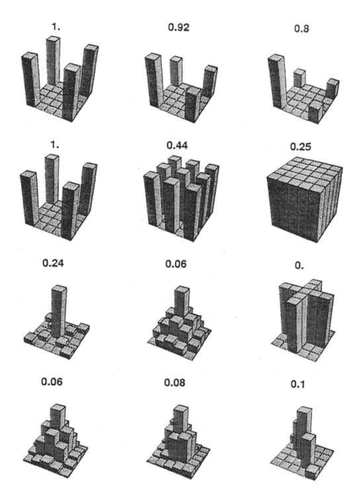
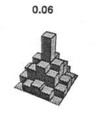

## Last time...

- Polynomials

- 3-way interactions

---

## Today

- Statistical power

---

## Power

What is (statistical) power? How can we increase power?

--

The likelihood of finding an effect *if the effect actually exists.* Power gets larger as we:
* increase our sample size
* reduce (error) variance
* raise our Type I error rate
* study larger effects


---

```{r, echo = F, fig.width = 10, fig.height = 8, message = F}
library(tidyverse)
mu = 100
s = 20
mean = 110
n = 20
sem = s/sqrt(n)
cv = qnorm(mean = mu, sd = sem, p = .05, lower.tail = F)

ggplot(data.frame(x = seq(70, 130)), aes(x)) +
  stat_function(fun = function(x) dnorm(x, m = mu, sd = sem)) +
  stat_function(fun = function(x) dnorm(x, m = mean, sd = sem)) +
  stat_function(fun = function(x) dnorm(x, m = mean, sd = sem),
                geom = "area", xlim = c(cv, 130), 
                aes(fill = "Power"), alpha = .5) +
  #geom_vline(aes(xintercept = mu))+
  #geom_vline(aes(xintercept = mean))+
  geom_hline(aes(yintercept = 0))+
  scale_x_continuous("Means", breaks = seq(70,130,10)) +
  scale_y_continuous(NULL, breaks = NULL) + 
  guides(color = F)+
  theme_bw()+
  theme( text = element_text(size = 20))
```

---

## Power in multiple regression (additive effects)

When calculating power for the omnibus test, use the expected multiple $R^2$ value to calculate an effect size:

$$\large f^2 = \frac{R^2}{1-R^2}$$
---

### Omnibus power
```{r}
R2 = .10
(f = R2/(1-R2))
library(pwr)
pwr.f2.test(u = 3, # number of predictors in the model
            f2 = f, 
            sig.level = .05, #alpha
            power =.90) # desired power
```

`v` is the denominator df of freedom, so the number of participants needed is v + p + 1.

---

### Coefficient power

To estimate power for a single coefficient, you need to consider (1) how much variance is accounted for by just the variable and (2) how much variance you'll account for in Y overall.

$$\large f^2 = \frac{R^2_Y-R^2_{Y.X}}{1-R_Y^2}$$
---
### Coefficient power

```{r}
R2 = .10
RX1 = .03
(f = (R2-RX1)/(1-R2))
pwr.f2.test(u = 3, # number of predictors in the model
            f2 = f, 
            sig.level = .05, #alpha
            power =.90) # desired power
```

`v` is the denominator df of freedom, so the number of participants needed is v + p + 1.
---

## Effect sizes (interactions)

To start our discussion on powering interaction terms, we need to first consider the effect size of an interaction. 

How big can we reasonably expect an interaction to be?

- Interactions are always partialled effects; that is, we examine the relationship between the product of variables X and Z only after we have controlled for X and controlled for Z. How does this affect the size of the relationship between XZ and Y?

???

The effect of XZ and Y will be made smaller as X or Z (or both) is related to the product -- the semi-partial correlation is always smaller than or equal to the zero-order correlation. 

---

## McClelland and Judd (1993)

Is it more difficult to find interaction effects in experimental studies or observational studies?

--

What factors make it relatively easier to find interactions in experimental work?

---

### Factors influencing power in experimental studies

- No measurement error of IV 
    * don't have to guess what condition a participant is in
    * measurement error is exacerbated when two variables measured with error are multiplied by each other
    
- Experimentalists can force cross-over interactions; observational studies may be restricted to fan interactions
    * cross-over interactions are easier to detect than fan interactions

- Experimentalists can concentrate scores on extreme ends on both X and Z
    * in observational studies, data tends to cluster around the mean 
    * increases variability in both X and Z, and in XZ

- Experimentalists can also force orthognality in X and Z

???

Other things: 

you can insure that you study the full range of X in an experiment, but you may have restricted range in an observational study

---

### McClelland and Judd's simulation

For the experiment simulations, we used 2 X 2 factorial designs, with values of X and Z equal to +1 and —1 and an equal number of observations at each of the four combinations of X and Z values.

```{r}
X = rep(c(-1,1), each = 50)
Z = rep(c(-1,1), times = 50)
table(X,Z)
```

---

### McClelland and Judd's simulation

For the field study simulations, we used values of X and Z that varied between the extreme values of +1 and —1. More specifically, in the field study simulations, values of X and Z were each sampled independently from a normal distribution with a mean of 0 and a standard deviation of 0.5. Values of X and Z were rounded to create equally spaced 9-point scales ranging from -1 to +1 because ranges in field studies are always finite and because ratings are often on scales with discrete intervals.

```{r}
X = rnorm(n = 100, mean = 0, sd = .5)
Z = rnorm(n = 100, mean = 0, sd = .5)
X = round(X/.2)*.2
Z = round(Z/.2)*.2

psych::describe(data.frame(X,Z), fast = T)
```
---

For the simulations of both the field studies and the experiments, $\beta_0 = 0, \beta_X=\beta_Z=\beta_{XZ} = 1.$ There were 100 observations, and errors for the model were sampled from the same normal distribution with a mean of 0 and a standard deviation of 4.

```{r}
Y = 0 + 1*X + 1*Z + 1*X*Z + rnorm(n = 100, mean = 0, sd = 4)
summary(lm(Y ~ X*Z))
```

---

From 100 simulations each, estimates of the model parameter $\beta_{XZ}$ the moderator or interaction effect equaled 0.977 and 0.979 for the field studies and experiments, respectively.
```{r}
set.seed(0305)
```

.pull-left[
```{r}
# for experimental studies
sim = 100
ebeta_xz = numeric(length = 100)
et_xz = numeric(length = 100)
for(i in 1:sim){
  # simulate data
  X = rep(c(-1,1), each = 50)
  Z = rep(c(-1,1), times = 50)
 
  
   Y = 0 + 1*X + 1*Z + 1*X*Z + 
    rnorm(n = 100, mean = 0, sd = 4)
  #run model
  model = lm(Y ~ X*Z)
  coef = coef(summary(model))
  #extract coefficients
  beta = coef["X:Z", "Estimate"]
  t_val = coef["X:Z", "t value"]
  #save to vectors
  ebeta_xz[i] = beta
  et_xz[i] = t_val
}
```
]
.pull-right[
```{r}
# for observational studies

obeta_xz = numeric(length = 100)
ot_xz = numeric(length = 100)
for(i in 1:sim){
  # simulate data
  X = rnorm(n = 100, mean=0, sd = .5)
  Z = rnorm(n = 100, mean=0, sd = .5)
  X = round(X/.2)*.2
  Z = round(Z/.2)*.2
  Y = 0 + 1*X + 1*Z + 1*X*Z + 
    rnorm(n = 100, mean = 0, sd = 4)
  #run model
  model = lm(Y ~ X*Z)
  coef = coef(summary(model))
  #extract coefficients
  beta = coef["X:Z", "Estimate"]
  t_val = coef["X:Z", "t value"]
  #save to vectors
  obeta_xz[i] = beta
  ot_xz[i] = t_val
}
```
]
---

```{r}
mean(ebeta_xz)
mean(obeta_xz)
```

```{r, echo = F, fig.width=10, fig.height=6}
data.frame(sim = rep(c("experimental", "observational"), each = 100),
           estimate = c(ebeta_xz, obeta_xz)) %>%
  ggplot(aes(x = estimate)) + 
  geom_density(aes(fill = sim, color = sim), alpha = .3) +
  scale_color_discrete("") + scale_fill_discrete("")+
  theme_bw() + theme(legend.position = "bottom")
```

---

```{r}
mean(et_xz)
mean(ot_xz)
```

```{r, echo = F, fig.width=10, fig.height=6}
data.frame(sim = rep(c("experimental", "observational"), each = 100),
           t_val = c(et_xz, ot_xz)) %>%
  ggplot(aes(x = t_val)) + 
  geom_density(aes(fill = sim, color = sim), alpha = .3) +
  geom_vline(aes(xintercept = qt(p = .975, df = 100-3-1)))+
  scale_x_continuous("t statistic") +
  scale_color_discrete("") + scale_fill_discrete("")+
  theme_bw() + theme(legend.position = "bottom")
```

---

```{r}
cv = qt(p = .975, df = 100-3-1)
esig = et_xz > cv
sum(esig)

osig = ot_xz > cv
sum(osig)
```

In our simulation, `r sum(esig)`% of experimental studies were statistically significant, whereas only `r sum(osig)`% of observational studies were significant. Remember, we built our simulation based on data where there really is an interaction effect (i.e., the null is false). 

McClelland and Judd found that 74% of experimental studies and 9% of observational studies were significant.

---

### Efficiency

```{r, echo = F, out.width='55%'}

```

???
Efficiency = the ratio of the variance of XZ (controlling for X and Z) of a design to the best possible design (upper right corner). High efficiency is better; best efficiency is 1. 

---

### Efficiency

.pull-left[
If the optimal design has N obserations, then to have the same standard error (i.e., the same power), any other design needs to have N*(1/efficency). 

So a design with .06 efficency needs $\frac{1}{.06} = 16.67$ times the sample size to detect the effect. 
]

.pull-right[

]

This particular point has been ["rediscovered"](https://statmodeling.stat.columbia.edu/2018/03/15/need-16-times-sample-size-estimate-interaction-estimate-main-effect/) as recently as 2018: 

* you need 16 times the sample size to detect an interaction as you need for a main effect of the same size. 

???

This generalizes to higher-order interactions as well. If you have a three-way interaction, you need 16*16 (256 times the number of people). 

---

## Observational studies: What NOT to do

Recode X and Z into more extreme values (e.g., median splits)
    * while this increases variance in X and Z, it also increases measurement error

Collect a random sample and then only perform analyses on the subsample with extreme values
    * reduces sample size and also generalizability
    
#### What can be done?
M&J suggest oversampling extremes and using weighted and unweighted samples

---

## Experimental studies: What NOT to do

Be mean to field researchers

Forget about lack of external validity and generalizability

Ignore power when comparing interaction between covariate and experimental predictors (ANCOVA or multiple regression with categorical and continuous predictors)