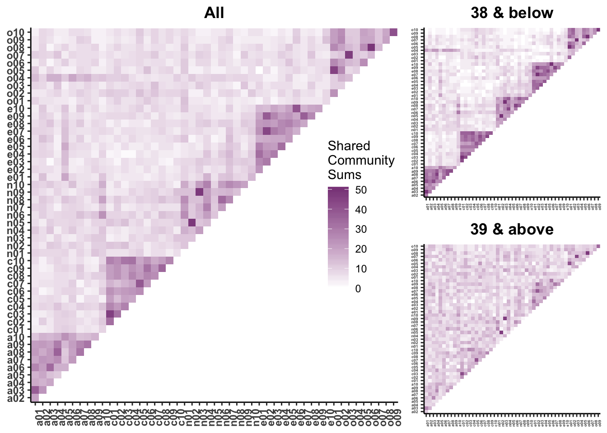

## Recap

Correlations are:

- Standardized covariances
     
     + Range from -1 to 1
     
- an effect size

    + Measure of the strength of association between two continuous variables
     
---

### Recap: testing the significance of a correlation

.pull-left[
If the null hypothesis is the **nil hypothesis**:
 
 - test significance using a *t*-distribution, where 
 
 $$\large t = \frac{r}{SE_r}$$
 $$\large SE_r = \sqrt{\frac{1-r^2}{N-2}}$$
 
 $$DF = N-2$$
 ]
 
 .pull-right[
 If null hypothesis is not 0 $(\text{e.g.,  }H_0:\rho_{xy} = .40)$
 
 - Transform statistic and null using Fisher's r to Z
 
 $$\large z^{'} = {\frac{1}{2}}ln{\frac{1+r}{1-r}}$$
 
 $$\large SE = \frac{1}{\sqrt{N-3}}$$
 
 ]
 
 
---

### Example

In PSY 302, the correlation between midterm exam grades and final exam grades was .56. The class size was 104. Is this statistically significant?

```{r, echo = F}
N = 104
r = .56

se = sqrt((1-r^2)/(N-2))

p1 = pt(r/se, df = N-2, lower.tail = F)
```


--
### Using t-method

$$\large SE_r = \sqrt{\frac{1-r^2}{N-2}} = \sqrt{\frac{1-.56^2}{104-2}} = `r round(se,2)`$$
$$\large t = \frac{r}{SE_r} = \frac{`r round(r,2)`}{`r round(se,2)`} = `r round(r/se,2)`$$

---


.left-column[
Probability of getting a *t* statistic of `r round(r/se,2)` or greater is `r p1`.

Probability of getting *t* statistic of `r round(r/se,2)` or more extreme is `r p1*2`.
]

```{r, echo = F, message = F, warning = F, results='hide'}
library(tidyverse)
data.frame(x = c(-3,7)) %>%
  ggplot(aes(x = x)) +
  stat_function(fun = function(x) dt(x = x, df = N-2), geom = "line") +
  geom_vline(aes(xintercept = r/se), color = "purple") + 
  ggtitle("t distribution (DF = 102)")+
  theme_bw()
```

---

### Example

In PSY 302, the correlation between midterm exam grades and final exam grades was .56. The class size was 104. Is this statistically significantly different from .40?

--

```{r, echo = F}
r = .56
N = 104
null = .40
zr = psych::fisherz(r)
znull = psych::fisherz(null)
se = 1/sqrt(N-3)
stat = (zr-znull)/se
```

$$\large z^{'} = {\frac{1}{2}}ln{\frac{1+r}{1-r}}= {\frac{1}{2}}ln{\frac{1+`r r`}{1-`r r`}} = `r round(zr,2)`$$
$$\large z^{'}_{H_0} = {\frac{1}{2}}ln{\frac{1+r}{1-r}}= {\frac{1}{2}}ln{\frac{1+`r null`}{1-`r null`}} = `r round(znull,2)`$$
$$ SE_z = \frac{1}{\sqrt{`r N`-3}} = `r round(se,2)`$$

---

$$Z_{\text{statistic}} = \frac{z'-\mu}{SE_z}=\frac{`r round(zr,2)`-`r round(znull,2)`}{`r round(se,2)`} = `r round(stat,2)`$$

```{r}
stat
pnorm(stat, lower.tail = F)
pnorm(stat, lower.tail = F)*2
```


---

## Today

- correlation matrices
- visualizing correlations
- reliability


---
## Correlation matrices

Correlations are both a descriptive and an inferential statistic. As a descriptive statistic, they're useful for understanding what's going on in a larger dataset. 

Like we use the `summary()` or `describe()` (psych) functions to examine our dataset _before we run any infernetial tests_, we should also look at the correlation matrix. 

---

```{r}
library(psych)
data(bfi)
head(bfi)
```

---

```{r}
cor(bfi)
```

---

```{r}
round(cor(bfi, use = "pairwise"),2)
```

---

```{r}
round(cor(bfi, use = "complete"),2)
```

---

With **pairwise deletion**, different sets of cases contribute to different correlations.  That maximizes the sample sizes, but can lead to problems if the data are missing for some systematic reason.

**Listwise deletion** (often referred to in `R` as use complete cases) doesn't have the same issue of biasing correlations, but does result in smaller samples and potentially limited generalizability.

A good practice is comparing the different matrices; if the correlation values are very different, this suggests that the missingness that affects pairwise deletion is systematic.

---

```{r}
round(cor(bfi, use = "pairwise")- cor(bfi, use = "complete"),2)
```
---

## Visualizing correlations

For a single correlation, best practice is to visualize the relationship using a scatterplot. A best fit line is advised, as it can help clarify the strength and direction of the relationship. 

[http://guessthecorrelation.com/](http://guessthecorrelation.com/)

---

```{r, echo = F}
library(datasauRus)
datasaurus_dozen %>%
  filter(dataset == "away") %>%
  ggplot(aes(x = x, y = y)) +
  geom_point()+
  ggtitle(expression(paste(M[X], "= 54.3 ", S[X], "= 16.8 ", 
                           M[Y], "= 47.8 ", S[Y], "= 26.9 ",
                           "R = -.06"))) +
  theme_bw(base_size = 15)
```


---

```{r, echo = F}
datasaurus_dozen %>%
  filter(dataset == "h_lines") %>%
  ggplot(aes(x = x, y = y)) +
  geom_point()+
  ggtitle(expression(paste(M[X], "= 54.3 ", S[X], "= 16.8 ", 
                           M[Y], "= 47.8 ", S[Y], "= 26.9 ",
                           "R = -.06"))) +
  theme_bw(base_size = 15)
```

---

```{r, echo = F}
datasaurus_dozen %>%
  filter(dataset == "x_shape") %>%
  ggplot(aes(x = x, y = y)) +
  geom_point()+
  ggtitle(expression(paste(M[X], "= 54.3 ", S[X], "= 16.8 ", 
                           M[Y], "= 47.8 ", S[Y], "= 26.9 ",
                           "R = -.06"))) +
  theme_bw(base_size = 15)
```

---

```{r, echo = F}
datasaurus_dozen %>%
  filter(dataset == "circle") %>%
  ggplot(aes(x = x, y = y)) +
  geom_point()+
  ggtitle(expression(paste(M[X], "= 54.3 ", S[X], "= 16.8 ", 
                           M[Y], "= 47.8 ", S[Y], "= 26.9 ",
                           "R = -.06"))) +
  theme_bw(base_size = 15)
```


---
```{r, echo = F}
datasaurus_dozen %>%
  filter(dataset == "wide_lines") %>%
  ggplot(aes(x = x, y = y)) +
  geom_point()+
  ggtitle(expression(paste(M[X], "= 54.3 ", S[X], "= 16.8 ", 
                           M[Y], "= 47.8 ", S[Y], "= 26.9 ",
                           "R = -.06"))) +
  theme_bw(base_size = 15)
```


---
```{r, echo = F}
datasaurus_dozen %>%
  filter(dataset == "bullseye") %>%
  ggplot(aes(x = x, y = y)) +
  geom_point()+
  ggtitle(expression(paste(M[X], "= 54.3 ", S[X], "= 16.8 ", 
                           M[Y], "= 47.8 ", S[Y], "= 26.9 ",
                           "R = -.06"))) +
  theme_bw(base_size = 15)
```

---
```{r, echo = F}
datasaurus_dozen %>%
  filter(dataset == "star") %>%
  ggplot(aes(x = x, y = y)) +
  geom_point(size = 2)+
  ggtitle(expression(paste(M[X], "= 54.3 ", S[X], "= 16.8 ", 
                           M[Y], "= 47.8 ", S[Y], "= 26.9 ",
                           "R = -.06"))) +
  theme_bw(base_size = 15)
```

---
```{r, echo = F}
datasaurus_dozen %>%
  filter(dataset == "dino") %>%
  ggplot(aes(x = x, y = y)) +
  geom_point(size = 2)+
  ggtitle(expression(paste(M[X], "= 54.3 ", S[X], "= 16.8 ", 
                           M[Y], "= 47.8 ", S[Y], "= 26.9 ",
                           "R = -.06"))) +
  theme_bw(base_size = 15)
```

---

## Visualizing correlation matrices

A single correlation can be informative; a correlation matrix is more than the sum of its parts. 

Correlation matrices can be used to infer larger patterns of relationships. You may be one of the gifted who can look at a matrix of numbers and see those patterns immediately. Or you can use **heat maps** to visualize correlation matrices. 

```{r, results = 'hide'}
library(corrplot)
```

---

```{r}
corrplot(cor(bfi, use = "pairwise"), method = "square")
```

---



.small[
[Beck, Condon, & Jackson, 2019](https://psyarxiv.com/857ev/)
]
---
## Other correlation tests:
1. Set of correlations
2. Dependent correlations (i.e., within same group)
  These are more easily tested via Structural Equation Modeling (SEM)
3. Intra Class Correlation (ICC)

- Again, best to do these tests in another framework (e.g., interaction, SEM, MLM)

---
## Factors that influence r (and most other test statistics)

1. Restriction of range (GRE scores and success)

2. Very skewed distributions (smoking and health)

3. Non-linear associations

4. Measurement overlap (modality and content)

5. Reliability

---
## Reliability


Which would you rather have?

  - 1-item final exam versus 30-item?

  - assessment via trained clinician vs tarot cards?

  - fMRI during minor earthquake vs no earthquake?

--

All measurement includes error

- Score = true score + measurement error (CTT version)

- Reliability assesses the consistency of measurement; high reliability indicates less error

---

## Reliability

- Cannot correlate error (randomness) with something

- Because we do not measure our variables perfectly we get lower correlations compared to true correlations

- If we want to have a valid measure it better be a reliable measure

---
## Reliability

- think of reliability as a correlation with a measure and itself in a different world, at a different time, or a different but equal version

$$\large r_{XX}$$

---
## Reliability

- true score variance divided by observed variance
- how do you assess theoretical variance i.e., true score variance?

$$\large r_{XY} = r_{X_{T} Y_{T}} {\sqrt{r_{XX}r_{YY}}}$$

$$\large r_{XY} = .6 {\sqrt {(.70) (.70)}}$$

---
## Reliability

$$\large r_{X_{T} Y_{T}} =  = {\frac {r_{XY}} {\sqrt{r_{XX}r_{YY}}}}$$


$$\large r_{X_{T} Y_{T}} =  = {\frac {.30} {\sqrt{(.70)(.70)}}} = .42$$


???

### Take aways

N needed for .42 = 42
N needed for .3 = 84 -- need twice as many people!!

it doesn't work the other way -- you can't take your correlation and back calculate the true score, because reliabilities are also estimates. these can be wrong; the correlation you calculate is the max it could bep

---
## Most common ways to assess

- cronbachs alpha
```{r, eval=FALSE}
library (psych)
alpha(measure)
## Gives average split half correlation
## Can tell you if you are assessing a single construct
```
- test - retest reliability
- Kappa or ICC

---
## Reliability

- if you are going to measure something do it well

- applies to ALL IVs and DVs, and all designs

- remember this when interpretting other's research

---
## Types of correlations

- Many ways to get at relationship between two variables

- Statistically the different types are almost exactly the same

- Exist for historical reasons

---

## Types of correlations
1. Point Biserial
    +  continuous and dichtomous
2. Phi coefficient
    + both dichotomous
3. Spearman rank order
    + ranked data (nonparametric)
4. Biserial (assumes dichotomous is continous)
5. Tetrachoric (assumes dichotomous is continous)
    + both dichotomous
6. Polychoric (assumes continous)
    + ordinal

---

class: inverse

## Next time....

Univariate regression

