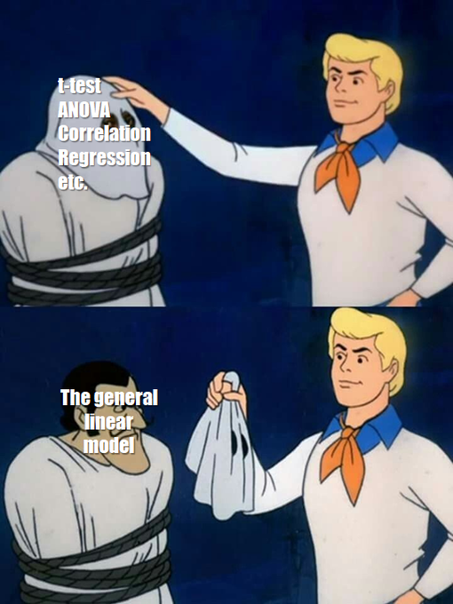

```{r, echo = F, results='hide',warning=FALSE,message=FALSE}
library(tidyverse)
library(knitr)
library(ggpubr)
# function to display only part of the output
# the default output hook
hook_output <- knit_hooks$get('output')
knit_hooks$set(output = function(x, options) {
  if (!is.null(n <- options$out.lines)) {
    n <- as.numeric(n)
    x <- unlist(stringr::str_split(x, "\n"))
    nx <- length(x) 
    x <- x[pmin(n,nx)]
    if(min(n) > 1)  
      x <- c(paste(options$comment, "[...]"), x)
    if(max(n) < nx) 
      x <- c(x, paste(options$comment, "[...]"))
    x <- paste(c(x, "\n"), collapse = "\n")
  }
  hook_output(x, options)
    }
  )
```

## Annoucements

* Moving model comparison to a later time
* Homework 1 due next Friday
* Updated language on syllabus -- I am an Assisting Employee

## Last time

Wrap up univariate regression

Confidence and prediction bands

---

## Today

General linear model

---

## Models

- Thus far you have used t-tests, correlations, and regressions to test basic questions about the world. 

- These types of tests can be thought of as a model for how you think "the world works"

- Our DV (Y) is what we are trying to understand

- We hypothesize it has some relationship with your IV(s) (Xs)  

$$Y_i = b_0  + b_1X_i + e_i$$
---


.pull-left[
### Independent samples t-test
```{r, eval=FALSE}

t.1 <- t.test(y ~ x, 
              data = d) 

```

- Y is continuous 
- X is a categorical/nominal (dichotomous) factor
]

.pull-left[
### Univariate regression
```{r, eval=FALSE}

r.1 <- lm(y ~ x, 
          data = d) 
```

- Y is continuous 
- X is continuous
]

---

## General linear model

This model (equation) can be very simple as in a treatment/control experiment. It can be very complex in terms of trying to understand something like academic achievement  

The majority of our models fall under the umbrella of a general(ized) linear model

  + The .purple[general linear model] is a family of models that assume the relationship between your DV and IV(s) is linear and additive, and that your residuals* are normally distributed. 
    
  + This is a subset of the .purple[generalized linear model] which allows for non-linear associations and non-normally distributed outcomes. 

All models imply our theory about how the data are generated (i.e., how the world works)

---

## Example
```{r, echo = FALSE, warning=FALSE, message=FALSE}
library(here)
traffic = read.csv(here("data/traffic.csv"))
```

```{r}
glimpse(traffic)
psych::describe(traffic, fast = T)
```

---

```{r, warning=FALSE, fig.width = 10}
traffic %>%
  ggplot() +
  aes(x = as.factor(tx), y = traffic.risk) +
  geom_boxplot() + geom_jitter() +
  theme_bw(base_size = 20)
```

---
## example
```{r fit_t, eval = F, echo = c(1)}
t.1 <- t.test(traffic.risk ~ tx, data = traffic, var.equal = TRUE) 
t.1
```

---
## example
```{r, ref.label="fit_t", echo = c(1)}
```

---
## example
```{r fit_r, eval = F, echo = c(1)}
r.1 <- cor.test(~ traffic.risk + tx, data = traffic) 
r.1
```

---
## example
```{r, ref.label="fit_r", echo = c(1)}
```

---
## example

```{r fit_aov, echo = c(1), eval = F}
a.1 <- aov(traffic.risk ~ tx, data = traffic)
summary(a.1)
```

---
## example

```{r ref.label = "fit_aov", echo = c(1)}
```

---
## example cont
```{r fit_lm, eval = F}
mod.1 <- lm(traffic.risk ~ tx, data = traffic)
summary(mod.1)
```

---
## example cont
```{r ref.label = "fit_lm"}
```

---
## example summary

Same p-values for each test; same SS; same test!  

- correlation gives you an effect size $(r)$ and $df$

- *t*-test gives you a $t$ & $df$ (output may give you group $M$ and $s$)    

- ANOVA gives you an $F$ (and $SS$s)  

- linear model (regression) gives you an equation in addition to $F$ and $SS$  

---
## *t*-test as regression

$$Y_i = b_{0} + b_{1}X_i + e_i$$

$$\text{traffic risk}_i = b_{0} + b_{1}\text{tx}_i + e_i$$

- Each individual (county) has a unique Y value, X value, and residual

- The model only has a single $b_{0}$ and $b_{1}$ term. 
    
    - $b_{0}$ is the intercept
    - $b_{1}$ quantifies the relationship between IV and the DV. 

---

## What do the estimates tell us? 

```{r, out.lines = 9:12}
summary(mod.1)
```
```{r}
psych::describeBy(traffic$traffic.risk, 
                  group = traffic$tx)
```

---
## How to interpret regression estimates

- Intercept is the mean of group of variable tx that is coded 0

- Regression coefficient is the difference in means between the groups (i.e., slope)

---
```{r, warning=FALSE, echo = FALSE}
ggplot(traffic %>% filter(!is.na(tx))) +
  aes(x = as.factor(tx), y = traffic.risk) +
  stat_summary(geom="bar", fun=mean, aes(fill = as.factor(tx))) + 
  geom_point(alpha = .2) + 
  stat_summary(geom="errorbar", fun.data=mean_cl_normal, 
                 fun.args=list(conf.int=0.95), width = .5)+
  ylim(0,5)+
  guides(fill = F) +
  theme_bw(base_size = 20)
```

---

```{r, echo=FALSE, warning= FALSE, message = F}
ggplot(traffic, aes(x=tx, y=traffic.risk)) +
    geom_point() +    
    geom_smooth(method=lm)  +  
  xlim(-.5, 1.5)+
  ylim(0,5)+
theme_bw(base_size = 20)
    
```

---

## How to interpret regression estimates

- Intercept $(b_0)$ signifies the level of Y when your model IVs (Xs) are zero 

- Regression $(b_1)$ signifies the difference for a one unit change in your X

- as with last semester you have estimates (like $\bar{X}$) and standard errors, which you can then ask whether they are likely assuming a null or create a CI
---

## *t*-test as regression

Regression coefficients are another way of presenting the expected means of each group, but instead of $M_1$ and $M_2$, we're given $M_1$ and $\Delta$ or the difference.

Now let's compare the inferential test of the two.

???

Matrix algebra for independent samples t-test
$$\large (T'T)^{-1}T'X = (b)$$

Matrix algebra for linear regression
$$\large (\mathbf{X'X})^{-1} \mathbf{X'y}=\mathbf{b}$$
---

```{r, highlight.output=c(12,19)}
summary(mod.1)
```

---
```{r, highlight.output = 5}
t.test(traffic.risk ~ tx, data = traffic)
```


---
## Statistical Inference

The *p*-values for the two tests are the same, because they are the same test. 

The probability distribution may differ... sort of. Recall that all these distributions are derived from the standard normal.

  - *t*-test uses a *t*-distribution
  - regression uses an *F*-distribution for the omnibus test
  - regression uses a *t*-distribution for the test of the coefficients
  
In the case of a single binary predictor, the *t*-statistic for the *t*-test will be identical to the *t*-statistic of the regression coefficient test.

The *F*-statistic of the omnibus test will be the *t*-statistic squared: $F = t^2$

---

```{r, highlight.output = 5}
library(here)
expertise = read.csv(here("data/expertise.csv"))
cor.test(expertise$self_perceived_knowledge, expertise$overclaiming_proportion, use = "pairwise")
```

---

```{r}
mod.2 = lm(overclaiming_proportion ~ self_perceived_knowledge, data = expertise)
```

```{r, highlight.output=c(13,19)}
summary(mod.2)
```

---

```{r}
mod.3 = lm(self_perceived_knowledge ~ overclaiming_proportion, data = expertise)
```

```{r, highlight.output=c(13,19)}
summary(mod.3)
```

---
Regression models provide all the same information as the *t*-test or correlation. But they provide additional information. 

Regression omnibus test are the same as *t*-test or correlation tests, even the same as ANOVAs. But the coefficient tests give you additional information, like intercepts, and make it easier to calculate predicted values and to assess relative fit.

---
## Predictions

- predictions $\hat{Y}$ are of the form of $E(Y|X)$

- They are created by simply plugging a persons X's into the created model

- If you have b's and have X's you can create a prediction

---

$\large \hat{Y}_{i} = 2.6506410 + -0.4811057X_{i}$

```{r, output.lines = c(10:13)}
mod.1 <- lm(traffic.risk ~ tx, data = traffic)
summary(mod.1)
```


---
## Predictions

- Unless you've collected a new dataset, you can't really assess the accuracy of predictions. Instead, we evaluate the fit to the data used to create the model. We want $\hat{Y}_i$ to be close to our actual data for each person $(Y_{i})$

- The difference between the actual data and our guess $(Y_{i}  - \hat{Y}_{i} = e)$ is the residual, how far we are "off". This tells us how good our fit is. 

- You can have the same estimates for two models but completely different fit. 

---

## Which one has better fit? 

```{r, echo=FALSE, warning=FALSE, message=FALSE, fig.width = 10}
twogroup_fun = function(nrep = 100, b0 = 6, b1 = -2, sigma = 1) {
     ngroup = 2
     group = rep( c("group1", "group2"), each = nrep)
     eps = rnorm(ngroup*nrep, 0, sigma)
     traffic = b0 + b1*(group == "group2") + eps
     growthfit = lm(traffic ~ group)
     growthfit
}


twogroup_fun2 = function(nrep = 100, b0 = 6, b1 = -2, sigma = 2) {
     ngroup = 2
     group = rep( c("group1", "group2"), each = nrep)
     eps = rnorm(ngroup*nrep, 0, sigma)
     traffic = b0 + b1*(group == "group2") + eps
     growthfit = lm(traffic ~ group)
     growthfit
}

set.seed(16)
library(broom)
lm1 <- augment(twogroup_fun())

set.seed(16)
lm2 <- augment(twogroup_fun2())

plot1<- ggplot(lm1) +
  aes(x = group, y = traffic) +
  geom_boxplot() + geom_jitter() + ylim(-1, 11)+ theme_bw(base_size = 20)

plot2<- ggplot(lm2) +
  aes(x = group, y = traffic) +
  geom_boxplot() + geom_jitter() + ylim(-1, 11)+ theme_bw(base_size = 20)


library(gridExtra)
 grid.arrange(plot1, plot2, ncol=2)
```


---
## Calculating fitted and predicted values

$$\hat{Y}_{i} = b_{0} + b_{1}X_{i}$$

$$Y_{i} = b_{0} + b_{1}X_{i} +e_{i}$$

$$Y_{i}  - \hat{Y}_{i} = e$$

- can you plug in numbers and calculate County 3's fitted and residual scores without explicitly asking for `lm` object residuals and fitted values?

```{r}
traffic[3, ]
```
$\large \hat{Y}_{i} = 2.65 + -0.48X_{i}$


---
## Predicting with new data

```{r}
mod.1

new.df = data.frame(
  tx = c(0,1)
)

predict(mod.1, newdata = new.df)
```

---

## A tangent about "predict"

"Predict" can refer to multiple things in a regression analyses.

- Fitted values of data used to estimate model $(\hat{Y}_i)$
- Fitted values of new data (machine learning)
- The range of possible/expected $Y$'s for any given X (prediction interval)

Some people are *really* picky about when you can and cannot use this term. 
   - I am not one of those people.
   - Pick a definition, explain it, and be consistent.

---

## A tangent about "predict"

.pull-left[
```{r}
predict(mod.1, 
        newdata = new.df, 
        interval = "confidence")
```
]

.pull-right[
```{r}
predict(mod.1, 
        newdata = new.df, 
        interval = "prediction")
```
]
---

```{r, echo = F, fig.width = 8, fig.height=5, message = F}
ci_est = predict(mod.1, 
        newdata = new.df, 
        interval = "confidence") %>%
  as.data.frame() %>%
  mutate(tx = c(0,1),
         interval = "confidence")

pred_est = predict(mod.1, 
        newdata = new.df, 
        interval = "prediction") %>%
  as.data.frame() %>%
  mutate(tx = c(0,1),
         interval = "prediction")

full_join(ci_est, pred_est) %>%
  ggplot(aes(x = tx, y = fit)) +
  geom_errorbar(aes(ymin = lwr, ymax = upr, color = interval)) +
  geom_point() +
  scale_x_continuous("tx", breaks = c(0,1)) +
  scale_y_continuous(expression(hat(Y))) +
  theme_pubr()
```


---

## Back to statistical inference

- To evaluate our model, we have to compare our guesses to some alternative guesses to see if we are doing well or not. 

- What is our best guess (i.e., prediction) if we didn't collect any data? 

$$\hat{Y} = \bar{Y}$$

- Regression can be thought of as: is $E(Y|X)$ better than $E(Y)$?

- To the extent that we can generate different guesses  of Y based on the values of the IVs, our model is doing well. Said differently, the closer our model is to the "actual" data generating model, our guesses $(\hat{Y})$ will be closer to our actual data $(Y)$  

---

## Partitioning variation 

$$\sum (Y - \bar{Y})^2 = \sum (\hat{Y} -\bar{Y})^2 + \sum(Y - \hat{Y})^2$$

- SS total = SS between + SS within

- SS total = SS regression + SS residual (or error)

Technically, we haven't gotten to ANOVA yet, but you can run and interpret an ANOVA with no problems given what we've talked about already. 

---
```{r}
set.seed(0214)
traffic$new_tx = sample(c("1","2","3"), size = nrow(traffic), replace = T)

a.2 = aov(traffic.risk ~ new_tx, data = traffic)
summary(a.2)
```

---
## summary

The general linear model is a way of mathematically building a theoretical model and testing it with data. GLMs assume the relationship between your IVs and DV is linear

- *t*-tests, ANOVAs, even $\chi^2$ tests are special cases of the general linear model. The benefit to looking at these tests through the perspective of a linear model is that it provides us with all the information of those tests and more! Plus it provides a more systematic way at 1) building and testing your theoretical model and 2) comparing between alternative theoretical models

You can get estimates and fit statistics from the model. Both are important. 

---

.pull-left[
<blockquote class="twitter-tweet"><p lang="en" dir="ltr">I made this meme for our stats class last week and I thought you might like to see it. <a href="https://t.co/ecnfsXHvey">pic.twitter.com/ecnfsXHvey</a></p>&mdash; Stuart Ritchie (@StuartJRitchie) <a href="https://twitter.com/StuartJRitchie/status/1188423700795801601?ref_src=twsrc%5Etfw">October 27, 2019</a></blockquote> <script async src="https://platform.twitter.com/widgets.js" charset="utf-8"></script>
]
.pull-right[

]

---

class: inverse

## Next time

Part- and partial correlations