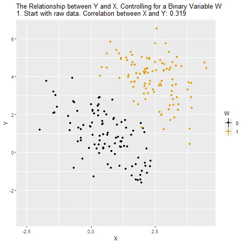
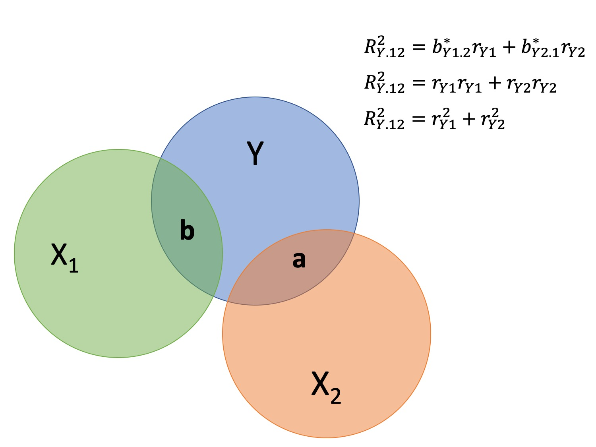
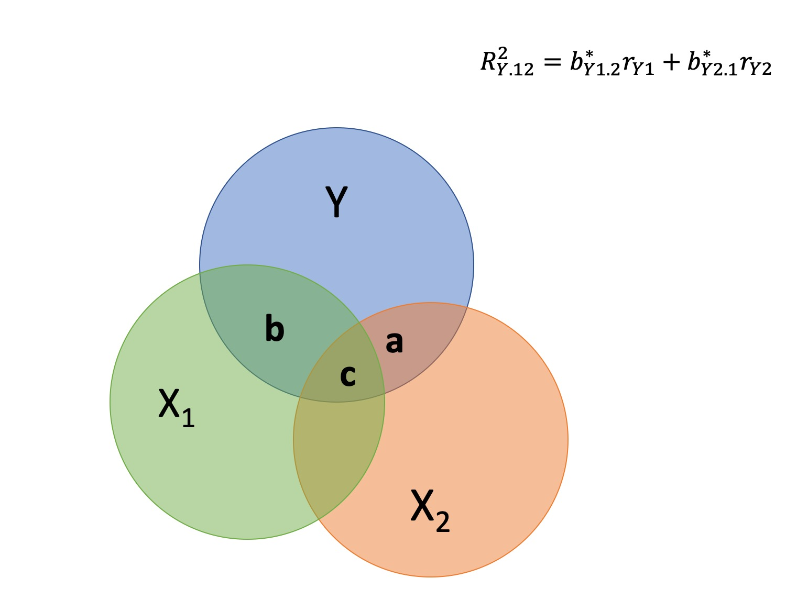

```{r, echo = F, results='hide',warning=FALSE,message=FALSE}
library(tidyverse)
library(knitr)
# function to display only part of the output
hook_output <- knit_hooks$get("output")
knit_hooks$set(output = function(x, options) {
  lines <- options$output.lines
  if (is.null(lines)) {
    return(hook_output(x, options))  # pass to default hook
  }
  x <- unlist(strsplit(x, "\n"))
  more <- "..."
  if (length(lines)==1) {        # first n lines
    if (length(x) > lines) {
      # truncate the output, but add ....
      x <- c(head(x, lines), more)
    }
  } else {
    x <- c(more, x[lines], more)
  }
  # paste these lines together
  x <- paste(c(x, ""), collapse = "\n")
  hook_output(x, options)
})
```

## Last time

- Semi-partial and partial correlations

## Today

- Introduction to multiple regression

---

## Regression equation

$$\large \hat{Y} = b_0 + b_1X_1 + b_2X_2 + \dots+b_kX_k$$

- regression coefficients are "partial" regression coefficients  

  - predicted change in $Y$ for a 1 unit change in $X$, *holding all other predictors constant* 
  
  - similar to semi-partial correlation -- represents part of each $X$

---

## example
```{r, message=FALSE}
library(here)
stress.data = read.csv(here("data/stress.csv"))
library(psych)
describe(stress.data$Stress)
```

---

## example

```{r, output.lines = c(9:19)}
mr.model <- lm(Stress ~ Support + Anxiety, data = stress.data)
summary(mr.model)
```

???

If a univariate regression is estimating the best-fit line, what is this estimating?

---
## Visualizing multiple regression

```{r}
library(visreg)

visreg2d(mr.model,"Support", "Anxiety", plot.type = "persp")

```

---

## Calculating coefficients 

Just like with univariate regression, we calculate the OLS solution. As a reminder, this calculation will yield the estimate that reduces the sum of the squared deviations from the line:

.pull-left[
### Unstandardized
$$\large \hat{Y} = b_0 + b_{1}X1 + b_{2}X_2$$
$$\large \text{minimize} \sum (Y-\hat{Y})^2 $$
]
.pull-right[

### Standardized
$$\large \hat{Z}_{Y} = b_{1}^*Z_{X1} + b_{2}^*Z_{X2}$$
$$\large \text{minimize} \sum (z_{Y}-\hat{z}_{Y})^2$$
]

---
## Calculating the standardized regression coefficient 

$$b_{1}^* = \frac{r_{Y1}-r_{Y2}r_{12}}{1-r_{12}^2}$$

$$b_{2}^* = \frac{r_{Y2}-r_{Y1}r_{12}}{1-r_{12}^2}$$


---

## Relationships between partial, semi- and b*  

(Standardized) Regression coefficients, partial correlations, and semi-partial correlations are all ways to represent the relationship between two variables while taking into account a third (or more!) variables. 

  - Each is a standardized effect, meaning the effect size is calculated in standardized units, bounded by -1 and 1*. This means they can be compared across studies, metrics, etc.

Note, however, that the calculations differ between the three effect sizes. These effect sizes are not synonymous and often yield different answers. 

  - if predictors are not correlated, sr $(r_{Y(1.2)})$ and pr $(r_{Y1.2})$ equal 

.small[*Actually, standardized regression coefficients are not bounded by -1 and 1, but it's rare to see values this large, and usually they're a sign that you have some problems in the model. ]
---

** Standardized multiple regression coefficient** $b^*$

$$\large \frac{r_{Y1}-r_{Y2}r_{12}}{1-r_{12}^2}$$


** Semi-partial correlation** $r_{y(1.2)}$
$$\large \frac{r_{Y1}-r_{Y2}r_{Y12} }{\sqrt{1-r_{12}^2}}$$

** Partial correlation** $r_{y1.2}$
$$\large \frac{r_{Y1}-r_{Y2}r_{{12}}}{\sqrt{1-r^2_{Y2}}\sqrt{1-r^2_{12}}}$$

---

```{r}
z_score = function(x){
  m = mean(x, na.rm=T)
  s = sd(x, na.rm=T)
  z = (x-m)/s
  return(z)
}

stress.data = stress.data %>%
  mutate(z_anxiety = z_score(Anxiety),
         z_support = z_score(Support),
         z_stress = z_score(Stress))

mod0 = lm(z_stress ~ z_anxiety + z_support, 
          data = stress.data)

round(coef(mod0),3)
```

.pull-left[
```{r, message=F, warning = F, echo = 2:4}
library(ppcor)
spcor.test(x = stress.data$Anxiety, 
           y = stress.data$Stress, 
           z = stress.data$Support)$estimate
```
]

.pull-right[

```{r, message=F, warning = F}
pcor.test(x = stress.data$Anxiety, 
          y = stress.data$Stress, 
          z = stress.data$Support)$estimate
```

]
---
    
## Original metric

$$b_{1} = b_{1}^*\frac{s_{Y}}{s_{X1}}$$

$$b_{1}^* = b_{1}\frac{s_{X1}}{s_{Y}}$$

### Intercept

$$b_{0} = \bar{Y} - b_{1}\bar{X_{1}} - b_{2}\bar{X_{2}}$$
---

```{r, highlight.output = 11}
mr.model <- lm(Stress ~ Support + Anxiety, data = stress.data)
summary(mr.model)
```

---

```{r, highlight.output = 12:13}
mr.model <- lm(Stress ~ Support + Anxiety, data = stress.data)
summary(mr.model)
```

---

## Matrix algebra

As we add variables to our model, the calculation of coefficient estimates using correlations and partial correlations gets more complicated. We'll only consider the formulas for the case of multiple regression with two variables, because as we move to three or more, these formulas become unreadable, although our interpretations are the same. 

But the matrix algebra calculations for coefficients remain the same. 

---

## Matrix algebra

.pull-left[

### Univariate regression

$$(\mathbf{X'X})^{-1} \mathbf{X'y}=\mathbf{b}$$
Where $\mathbf{X}$ is an $n \times 2$ matrix, where the first column is composed of 1's and the second column are participant's scores on X.
]

.pull-left[

### Mutiple regression

$$(\mathbf{X'X})^{-1} \mathbf{X'y}=\mathbf{b}$$

Where $\mathbf{X}$ is an $n \times (k+1)$ matrix, where the first column is composed of 1's and the columns 2-(k+1) are participant's scores on k IV's $(X_1...X_{K})$.
]

---

```{r}
X.mat = cbind(1,stress.data[,c("Anxiety", "Support")])
X.mat = as.matrix(X.mat)

y.mat = as.matrix(stress.data[,c("Stress")])

solve(t(X.mat) %*% X.mat) %*% t(X.mat) %*% y.mat

coef(mr.model)
```


---

### "Controlling for"



Taken from [@nickchk](https://twitter.com/nickchk)

---

## Estimating model fit

```{r, highlight.output = 18}
mr.model <- lm(Stress ~ Support + Anxiety, data = stress.data)
summary(mr.model)
```

---

```{r}
library(broom)
stress.data1 = augment(mr.model)
stress.data1 %>%
  ggplot(aes(x = Stress, y = .fitted)) + geom_point() + geom_smooth(method = "lm") + scale_x_continuous("Y (Stress)") + scale_y_continuous(expression(hat(Y))) + theme_bw(base_size = 20)
```

---
## Multiple correlation, R

$$\large \hat{Y} = b_{0} + b_{1}X_{1} + b_{2}X_{2}$$


- $\hat{Y}$ is a linear combination of Xs
- $r_{Y\hat{Y}}$ = multiple correlation = R

--

$$\large R = \sqrt{b_{1}^*r_{Y1} + b_{2}^*r_{Y2}}$$
$$\large R^2 = {b_{1}^*r_{Y1} + b_{2}^*r_{Y2}}$$

---


---



---
## Decomposing sums of squares

We haven't changed our method of decomposing variance from the univariate model

$$\Large \frac{SS_{regression}}{SS_{Y}} = R^2$$
$$\Large {SS_{regression}} = R^2({SS_{Y})}$$


$$\Large {SS_{residual}} = (1- R^2){SS_{Y}}$$
  
---

## significance tests

- $R^2$ (omnibus)  
- Regression Coefficients  
- Increments to R2  
    
---

## R-squared, $R^2$


- Same interpretation as before  

- Adding predictors into your model will increase $R^2$ – regardless of whether or not the predictor is significantly correlated with Y.    

- Adjusted/Shrunken $R^2$ takes into account the number of predictors in your model  


---

## Adjusted R-squared, $\text{Adj} R^2$

$$\large R_{A}^2 = 1 - (1 -R^2)\frac{n-1}{n-p-1}$$

- What happens if you add many IV's to your model that are uncorrelated with your DV?

--


- What happens as you add more covariates to your model that are highly correlated with your key predictor, X?

$$b_{1}^* = \frac{r_{Y1}-r_{Y2}r_{12}}{1-r_{12}^2}$$


---

## ANOVA

```{r, highlight.output = 19}
summary(mr.model)
```
---

## ANOVA

```{r, highlight.output = 5:6}
anova(mr.model)
```


---

```{r, highlight.output = 12:13}
summary(mr.model)
```

---

## Standard errors

$$\Large H_{0}: \beta_{X}= 0$$
$$\Large H_{1}: \beta_{X} \neq 0$$

---

## Standard error of regression coefficient

In the case of univariate regression:

$$\Large se_{b} = \frac{s_{Y}}{s_{X}}{\sqrt{\frac {1-r_{xy}^2}{n-2}}}$$

In the case of multiple regression:

$$\Large se_{b} = \frac{s_{Y}}{s_{X}}{\sqrt{\frac {1-R_{Y\hat{Y}}^2}{n-p-1}}} \sqrt{\frac {1}{1-R_{i.jkl...p}^2}}$$

- As N increases... 
- As variance explained increases... 
